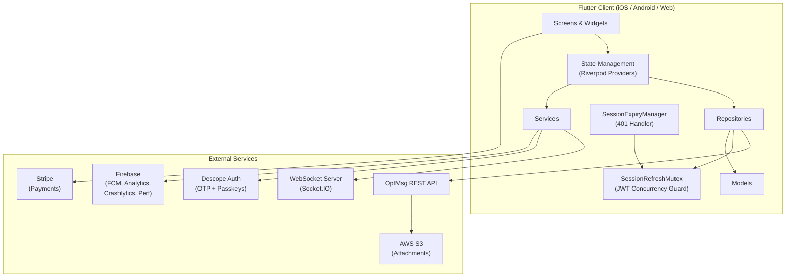
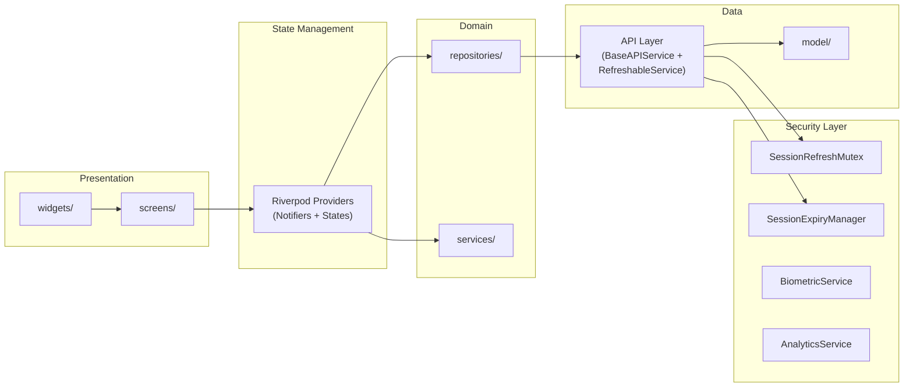
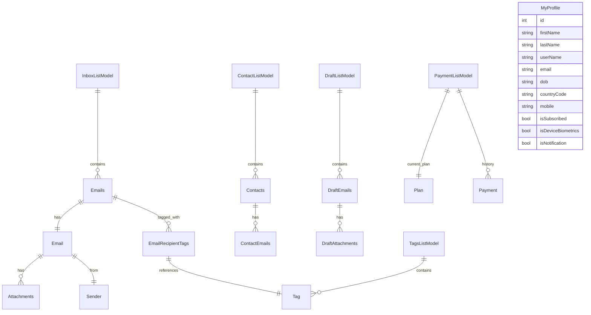
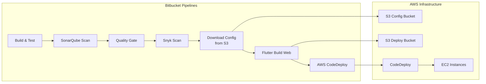

# OptMsg - Codebase Documentation

## Table of Contents

1. [Repository Overview](#1-repository-overview)
2. [Architecture & System Design](#2-architecture--system-design)
3. [Codebase Structure](#3-codebase-structure)
4. [Module/Feature Documentation](#4-modulefeature-documentation)
5. [Data Models](#5-data-models)
6. [API Reference](#6-api-reference)
7. [Critical Flows & Session Management](#7-critical-flows--session-management)
8. [Development Guide](#8-development-guide)
9. [Deployment & Infrastructure](#9-deployment--infrastructure)
10. [Contributing Guide](#10-contributing-guide)
11. [Known Issues & Roadmap](#11-known-issues--roadmap)

---

## 1. Repository Overview

### Purpose & Description

**OptMsg** is a cross-platform secure email communication application built with Flutter. It provides a privacy-focused, opt-in email service with inbox management, contact management, tagging, archiving, drafts, real-time notifications, biometric authentication, passkey support, and subscription-based payment plans.

### Core Problem & Target Users

OptMsg solves the need for a dedicated, secure, opt-in email communication platform that works seamlessly across mobile (iOS/Android) and web. Target users are individuals and organizations seeking a managed email solution where recipients explicitly opt in to receive messages, with features like biometric lock, passkey login, contact syncing, and real-time push notifications.

### Key Architectural Decisions

| Decision | Rationale |
|----------|-----------|
| **Flutter (cross-platform)** | Single codebase for iOS, Android, and Web |
| **Riverpod for state management** | Type-safe, testable, and scalable state management |
| **GoRouter for navigation** | Declarative routing with deep linking and auth guards |
| **Repository pattern** | Clean separation between API layer and business logic |
| **Descope for authentication** | Managed auth with OTP, passkeys (WebAuthn), and session management |
| **Firebase suite** | Analytics, crash reporting, push notifications, performance monitoring |
| **Socket.IO for real-time** | WebSocket-based real-time notifications and message delivery |
| **Freezed for code generation** | Immutable state classes with `copyWith`, JSON serialization |
| **SessionRefreshMutex** | Process-wide mutex preventing concurrent JWT refresh races |
| **SessionExpiryManager** | Idempotent 401 handler preventing duplicate logout flows |
| **Compile-time endpoint resolution** | API URLs resolved via `app_config.dart` at build time (no runtime sync risk) |

### Technology Stack

| Technology | Version | Purpose |
|------------|---------|---------|
| Flutter | >=3.41.2 <4.0.0 | UI framework |
| Dart | >=3.11.0 <4.0.0 | Language |
| flutter_riverpod | 3.2.1 | State management |
| go_router | 17.1.0 | Navigation & routing |
| dio | 5.9.2 | HTTP client (repositories) |
| descope | 0.9.18 | Authentication (OTP + passkeys) |
| firebase_core | 4.5.0 | Firebase services |
| firebase_messaging | 16.1.2 | Push notifications |
| firebase_crashlytics | 5.0.8 | Crash reporting |
| firebase_analytics | 12.1.3 | Usage analytics |
| firebase_performance | 0.11.1+5 | Performance monitoring |
| socket_io_client | 3.1.2 | Real-time communication |
| freezed | 3.2.5 | Code generation |
| freezed_annotation | 3.0.0 | Annotation support |
| local_auth | 3.0.1 | Biometric authentication |
| flutter_secure_storage | 10.0.0 | Encrypted local storage |
| flutter_inappwebview | 6.1.5 | In-app WebView (compose, print, checkout) |

---

## 2. Architecture & System Design

### System Architecture



### Component Responsibilities



### Secure Storage Architecture

The app stores sensitive user data (PII, auth flags, payment info) via `SecureStorageService` which delegates to a platform-specific `PlatformSecureStorage` implementation.

**Files:**
- `lib/services/storage_service.dart` — `SecureStorageService`: high-level wrapper (read/write/delete + SharedPreferences)
- `lib/services/storage/platform_secure_storage.dart` — Factory + `PlatformSecureStorage` interface
- `lib/services/storage/platform_secure_storage_stub.dart` — Mobile impl (iOS Keychain / Android EncryptedSharedPreferences via `flutter_secure_storage`)
- `lib/services/storage/platform_secure_storage_web.dart` — Web impl (AES-GCM-256 encrypted localStorage)
- `lib/services/storage/web_crypto_helper.dart` — Web-only AES-GCM encryption helper using browser WebCrypto API

**Encryption at rest by platform:**

| Platform | Mechanism | Key Storage |
|----------|-----------|-------------|
| iOS | Keychain (hardware-backed) | Managed by OS |
| Android | EncryptedSharedPreferences (AES) | Android Keystore |
| Web | AES-GCM-256 via WebCrypto API | Non-extractable `CryptoKey` in IndexedDB |

**Web encryption details:**
- All values written to `localStorage` are AES-GCM-256 encrypted before storage
- The encryption key is generated via `crypto.subtle.generateKey()` with `extractable: false` — JavaScript cannot read the raw key bytes
- The key is stored in IndexedDB (`optmsg_keystore` database) as an opaque `CryptoKey` object, shared across all tabs on the same origin
- Encrypted values use the `optmsg_enc_` prefix; legacy plaintext values (`optmsg_secure_` prefix) are transparently migrated on first read
- Encrypted payload format: `base64( [12-byte IV] [ciphertext] [16-byte GCM auth tag] )`
- Fallbacks: insecure context (HTTP) → plaintext with legacy prefix; IndexedDB unavailable → in-memory key; decryption failure → returns null (triggers re-login)

**Sensitive keys stored (all encrypted at rest):**

| Key | Content | Sensitivity |
|-----|---------|-------------|
| `userData` | Full user profile (name, DOB, phone, email, subscription) + auth token | Critical PII |
| `loginId` | Phone number | Sensitive |
| `payment_data` | Subscription payment history | Sensitive |
| `selected_plan` | Stripe product IDs | Moderate |
| `deviceToken` | FCM push token | Moderate |
| `userProfileData` | Cached profile data | PII |
| `isAuthenticated`, `isBiometricEnable`, `hasPasskeyEnrolled` | Auth/biometric flags | Low |

**SharedPreferences** (separate from secure storage) stores only UI state flags (sidebar position, popup dismissals, navigation state). On web these use `localStorage` unencrypted since they contain no PII.

### Data Flow

1. **User Action** → Screen widget triggers a Riverpod provider method
2. **Provider/Notifier** → Calls repository or service method, updates state
3. **Repository** → Calls API service (extends `RefreshableService`), returns `Result<T>`
4. **API Service** → Refreshes JWT via `SessionRefreshMutex.guardedRefreshIfNeeded()`, makes HTTP request, parses response into Model
5. **State Update** → Provider emits new state, UI rebuilds reactively
6. **Error Path** → 401/405 → `SessionExpiryManager.handleExpiry()` → `setAuthenticated(false)` → GoRouter redirect → `/login`

### Real-Time Flow (WebSocket)

1. **SocketService** → Connects to Socket.IO server on login (`initSocket()`)
2. **Server Events** → `newMessage`, `unReadCount`, `notificationExists`, `paymentStatus`, `tagList`, `addCardSuccess`, `msgOptInApp`
3. **StreamControllers** → Events emitted to Dart streams (cleaned up on reinit per M-17)
4. **Providers** → Listen to streams, update UI state (badge counts, new emails)
5. **Reconnection** → `reconnectIfNeeded()` called on app resume; uses fresh JWT per H-13

---

## 3. Codebase Structure

### Directory Tree

```
app/
├── android/                             # Android platform project
│   ├── app/
│   │   ├── build.gradle                 # Build config: 3 flavors (dev, stage, prod)
│   │   └── src/
│   │       ├── main/                    # Main Android manifest & resources
│   │       │   └── res/xml/data_extraction_rules.xml  # Data extraction config
│   │       ├── debug/                   # Debug-specific config
│   │       └── profile/                 # Profile-specific config
│   └── key/                             # Keystore files for signing
├── ios/                                 # iOS platform project
│   ├── Runner/
│   │   ├── Firebase/                    # Per-environment GoogleService-Info.plist
│   │   │   ├── dev/
│   │   │   ├── stage/
│   │   │   └── prod/
│   │   ├── AppDelegate.swift            # iOS app delegate
│   │   ├── Info.plist                   # iOS app configuration
│   │   ├── Runner.entitlements          # App entitlements (debug)
│   │   ├── RunnerRelease.entitlements   # App entitlements (release)
│   │   └── Assets.xcassets/             # App icons (dev, stage, prod variants)
│   │       └── AppIcon-prod.appiconset/ # Production icon set
│   └── RunnerTests/                     # iOS test target
├── web/                                 # Web platform assets
│   ├── index.html
│   ├── splash/                          # Web splash screen
│   └── icons/                           # PWA icons
├── lib/                                 # *** MAIN APPLICATION SOURCE ***
│   ├── main.dart                        # App entry point & bootstrapping
│   ├── firebase_options.dart            # Generated Firebase config
│   ├── common/                          # Shared utilities
│   │   ├── app_manger/                  # App cache & environment detection
│   │   │   ├── app_cache.dart           # In-memory cache (cleared on logout)
│   │   │   └── app_environment.dart     # Runtime environment resolution
│   │   ├── responsive/                  # Responsive layout system
│   │   │   ├── breakpoints.dart         # AppBreakpoints: device detection, breakpoint constants
│   │   │   ├── responsive.dart          # Export barrel
│   │   │   └── responsive_layout_builder.dart  # ResponsiveLayoutBuilder widget + context extension
│   │   └── utilites/                    # Utilities
│   │       ├── logger.dart              # Debug-only printLog()
│   │       ├── secure_print_helper.dart # JWT-free print preview (token via header)
│   │       ├── secure_url_helper.dart   # JWT extraction, URL token stripping
│   │       ├── stripe_url_validator.dart # Stripe redirect URL validation
│   │       ├── url_strategy_noop.dart   # URL strategy stub (mobile)
│   │       └── url_strategy_web.dart    # URL strategy (web — removes hash)
│   ├── constant/                        # Application constants
│   │   ├── app_config.dart              # Compile-time environment URLs, API keys, config
│   │   ├── common_constant.dart         # Shared constants
│   │   ├── img_path.dart                # Asset image paths
│   │   ├── string_constant.dart         # UI string constants, font families
│   │   └── styles.dart                  # AppStyles: theme styles, colors, text styles
│   ├── core/                            # Core abstractions
│   │   └── result.dart                  # Result<T> type for error handling
│   ├── model/                           # Data models
│   │   ├── auth/                        # Auth-related state models (freezed)
│   │   │   ├── auth_state.dart          # AuthState: status, userData, isInitialized
│   │   │   ├── auth_state.freezed.dart  # Generated
│   │   │   ├── enter_otp_state.dart     # OTP screen state
│   │   │   ├── enter_otp_state.freezed.dart
│   │   │   ├── passkey_state.dart       # Passkey setup state
│   │   │   └── passkey_state.freezed.dart
│   │   ├── base_response/               # API response wrappers
│   │   │   ├── request_response.dart    # RequestResponse: generic success wrapper
│   │   │   └── request_error.dart       # RequestError: status, message, field errors
│   │   ├── inbox_list_model.dart        # Emails, Email, Attachments, Sender, Tags
│   │   ├── contact_list_model.dart      # Contacts, ContactEmails
│   │   ├── sent_list_model.dart         # SentListModel
│   │   ├── view_email_model.dart        # Email detail view model
│   │   ├── notification_list_model.dart # Notification data
│   │   ├── request_add_contact_modal.dart # Contact add request
│   │   └── ...                          # Other domain models
│   ├── repositories/                    # Data access layer
│   │   ├── base/                        # Base API infrastructure
│   │   │   ├── base_api_service.dart    # BaseAPIService: HTTP execution, 401 handling
│   │   │   ├── refreshable_api.dart     # RefreshableService: JWT refresh wrapper
│   │   │   └── http_client_factory*.dart # Platform-specific HTTP client creation
│   │   ├── auth/auth_api.dart           # AuthApi: login, OTP, signup endpoints
│   │   ├── account/account_api.dart     # AccountApi: profile, payment, account
│   │   ├── contact/                     # Contact CRUD
│   │   │   ├── contact_api.dart
│   │   │   └── contact_repository.dart
│   │   ├── email/                       # Email APIs
│   │   │   ├── inbox_api.dart           # InboxApi (returns empty msg on 401/405)
│   │   │   ├── draft_api.dart
│   │   │   └── archive_api.dart
│   │   ├── inbox/                       # Email detail repositories
│   │   │   ├── inbox_repository.dart
│   │   │   └── email_detail_repository.dart
│   │   ├── draft/draft_repository.dart
│   │   ├── notification/notification_api.dart
│   │   ├── setting/setting_api.dart     # SettingApi (uses BaseAPIService, not ApiService)
│   │   ├── tags/tag_api.dart
│   │   └── end_point/end_point.dart     # API endpoint URL definitions (compile-time)
│   ├── screens/                         # UI screens (feature-organized)
│   │   ├── auth/                        # Authentication flows
│   │   │   ├── auth_riverpod/           # Auth state management
│   │   │   │   └── auth_notifier.dart   # AuthNotifier: login, logout, session restore
│   │   │   ├── login/                   # Login screen (mobile + desktop layouts)
│   │   │   ├── createAccount/           # Signup screen
│   │   │   ├── enterOtp/               # OTP verification
│   │   │   ├── setupProfile/           # Profile setup (signup)
│   │   │   ├── passKey/                # Passkey enrollment
│   │   │   ├── userNameSuccess/        # Success confirmation
│   │   │   ├── forgotUserName/         # Username recovery
│   │   │   ├── login_post_processor.dart # Post-login processing
│   │   │   └── web/                    # Web-specific auth screens
│   │   │       ├── enterOtp/           # Web OTP (separate Descope handling)
│   │   │       ├── forgotUserName/
│   │   │       ├── createAccount/
│   │   │       └── paymentSuccess/
│   │   ├── dashboard/                   # Navigation shell
│   │   │   ├── bottom_nav_provider.dart # BottomNavNotifier: tab state
│   │   │   ├── bottom_nav_state.dart
│   │   │   └── bottom_navigation_bar.dart
│   │   ├── email/                       # Email feature screens (riverpod-based)
│   │   │   ├── inbox_riverpod/         # Inbox list + detail
│   │   │   ├── draft_riverpod/         # Drafts
│   │   │   └── archive_riverpod/       # Archive
│   │   ├── inbox/                       # Email viewing & attachments
│   │   │   ├── inbox.dart              # Main inbox screen
│   │   │   ├── view_inbox.dart         # Email detail view
│   │   │   ├── mail_html_view.dart     # HTML email renderer
│   │   │   ├── attachment_preview_screen.dart
│   │   │   ├── custom_file_downloader_manager.dart
│   │   │   └── widget/                 # Full-screen image, PDF, WebView viewers
│   │   ├── compose/                    # Email composition
│   │   │   └── web_compose.dart        # WebView-based rich compose (token via header)
│   │   ├── contacts/                   # Contact management (riverpod-based)
│   │   │   ├── contacts_riverpod/      # Contact list
│   │   │   ├── add_contact_riverpod/   # Add contact
│   │   │   ├── edit_contact_riverpod/  # Edit contact
│   │   │   └── view_contact_riverpod/  # View contact detail
│   │   ├── notifications/              # Notification list
│   │   │   └── notification_riverpod/
│   │   ├── settings/                   # Settings screens (riverpod-based)
│   │   │   ├── setting_riverpod/       # Main settings + logout
│   │   │   ├── account_riverpod/       # Account management
│   │   │   └── profile_riverpod/       # Profile editing
│   │   ├── subscription/               # Payment & subscription
│   │   │   ├── plans/                  # Plan selection
│   │   │   ├── checkout/               # Stripe checkout
│   │   │   ├── change_payment/         # Payment method update
│   │   │   ├── change_subscription/    # Subscription change
│   │   │   └── subscription_details/   # Subscription detail view
│   │   ├── tags/                       # Tag management
│   │   │   └── tag_riverpod/
│   │   ├── helpCenter/                 # Help center
│   │   ├── staticPages/                # Static content pages (FAQ, terms, privacy)
│   │   └── (no_internet_screen removed — connectivity handled by global snackbar in main.dart)
│   ├── services/                        # Business logic services
│   │   ├── api_service.dart             # ApiService: HTTP client with JWT refresh + global loading
│   │   ├── session_refresh_mutex.dart   # Process-wide JWT refresh mutex
│   │   ├── session_expiry_manager.dart  # Idempotent 401 session expiry handler
│   │   ├── biometric_service.dart       # Face ID / Touch ID authentication
│   │   ├── analytics_service.dart       # Firebase Analytics wrapper with event constants
│   │   ├── common_service.dart          # Utility methods (dates, toasts, platform detection)
│   │   ├── count_notifier.dart          # Riverpod: inbox/draft/archive/trash unread counts
│   │   ├── descope_api_service.dart     # Descope REST API client
│   │   ├── email_sender_service.dart    # Email sending logic
│   │   ├── floating_action_button_location.dart
│   │   ├── global_variable_state.dart   # Global app state (loading paths, navigation)
│   │   ├── notification_service.dart    # FCM + local notifications
│   │   ├── socket_service.dart          # WebSocket client (singleton)
│   │   ├── storage_service.dart         # SecureStorageService: encrypted storage + SharedPrefs
│   │   ├── storage/                     # Platform-specific secure storage
│   │   │   ├── platform_secure_storage.dart      # Factory: createPlatformSecureStorage()
│   │   │   ├── platform_secure_storage_web.dart   # Web impl (AES-GCM encrypted localStorage)
│   │   │   ├── platform_secure_storage_stub.dart  # Mobile impl (FlutterSecureStorage)
│   │   │   └── web_crypto_helper.dart             # WebCrypto AES-GCM + IndexedDB key mgmt
│   │   ├── tags_provider.dart           # Tags state provider
│   │   ├── update_provider.dart         # App update detection (soft/hard)
│   │   ├── adaptive_service.dart        # (DEPRECATED) Migrated to AppBreakpoints
│   │   ├── file_picker_service.dart    # Mobile file/image picker (single + multi-select)
│   │   ├── web_file_picker_service.dart # Web file/image picker (single + multi-select)
│   │   └── web_utils_web.dart           # Web-specific utilities
│   ├── router/                          # Navigation
│   │   ├── app_router.dart              # GoRouter config with auth guards + Stripe redirect
│   │   ├── app_routes.dart              # Route path constants
│   │   ├── navigation_helper.dart       # AppNavigator facade + NavigationContext extension
│   │   ├── route_observer_service.dart  # Firebase Analytics route tracking + last-route persistence
│   │   ├── route_extras.dart            # Type-safe GoRouter extra extraction
│   │   └── responsive_route_wrappers.dart
│   ├── widgets/                         # Reusable UI components (45+ files)
│   │   ├── shell_layout.dart            # Main app shell: sidebar + bottom nav + compose FAB
│   │   ├── side_menu.dart               # Desktop sidebar
│   │   ├── drawer.dart                  # Navigation drawer
│   │   ├── email_list.dart              # Email list component
│   │   ├── draft_email_list.dart        # Draft email list
│   │   ├── sent_email_list.dart         # Sent email list
│   │   ├── gradient_appbar.dart         # Custom gradient app bar (mobile)
│   │   ├── gradient_webbar.dart         # Custom gradient bar (web)
│   │   ├── pop_up_modal.dart            # Custom modal dialogs
│   │   ├── pop_up_modal_tag_list.dart   # Tag selection modal
│   │   ├── skeleton_loader.dart         # Loading skeleton
│   │   ├── text_form_field.dart         # Custom text field
│   │   ├── button_form_field.dart       # Custom button
│   │   ├── search_bar.dart              # Search bar
│   │   ├── notification_item.dart       # Notification list item
│   │   ├── onboarding.dart              # Onboarding widgets
│   │   ├── profile_view.dart            # Profile display
│   │   ├── email_plans.dart             # Plan display
│   │   ├── credit_card.dart             # Card input
│   │   ├── tag_input_field.dart         # Tag input
│   │   ├── custom_dismissible.dart      # Swipe-to-dismiss
│   │   ├── custom_switchlist.dart       # Toggle switch
│   │   ├── draggable_divider.dart       # Reading pane divider
│   │   ├── load_container/              # Loading overlay
│   │   │   ├── load_container.dart
│   │   │   ├── loader_provider.dart
│   │   │   └── delayed_loading_overlay.dart
│   │   ├── web_login_content.dart       # Web login layout
│   │   ├── web_menu_items.dart          # Web menu items
│   │   ├── web_mobile_bottom_nav.dart   # Web mobile bottom nav
│   │   ├── upgrade_plan_popup.dart      # Upgrade prompt
│   │   └── ...                          # More widgets
│   └── webPackerHandler/                # Platform-specific checkout handling
│       ├── platform_check.dart          # Platform detection
│       ├── base_check_out.dart          # Abstract checkout
│       ├── mobile_check_out.dart        # Mobile checkout
│       ├── web_check_out.dart           # Web checkout (Stripe redirect)
│       └── stub_check_out.dart          # Stub for conditional imports
├── test/                                # Test files
│   ├── sample_test.dart
│   └── auth_notifier_test.dart
├── docs/                                # Generated documentation
│   ├── CODEBASE_DOCUMENTATION.md        # This file
│   ├── PRODUCTION_AUDIT_REPORT.md       # Production readiness audit
│   ├── RIVERPOD_AUDIT_REPORT.md         # Riverpod usage audit
│   └── TEST_CASE_*.md/.csv             # Test case specifications
├── assets/                              # Static assets
│   ├── fonts/                           # Font files
│   │   ├── Figtree-VariableFont_wght.ttf
│   │   ├── NotoSans-VariableFont_wdth,wght.ttf
│   │   └── Manrope-VariableFont_wght.ttf
│   ├── icon/                            # App icons
│   ├── icons/                           # UI icons
│   ├── svg/                             # SVG assets
│   │   ├── extensionsTypeSvg/           # File type icons
│   │   └── onboarding/                  # Onboarding SVGs
│   ├── img/                             # Images
│   └── splash/                          # Splash screen assets
├── pubspec.yaml                         # Dependencies & project config
├── analysis_options.yaml                # Dart linter configuration
├── analyze.sh                           # Flutter analyze helper script
├── bitbucket-pipelines.yml              # CI/CD pipeline
├── sonar-project.properties             # SonarQube config
├── flutter_launcher_icons.yaml          # App icon generation config
└── flutter_native_splash.yaml           # Splash screen config
```

### Naming Conventions

| Convention | Example | Where Used |
|-----------|---------|-----------|
| `snake_case.dart` | `inbox_list_model.dart` | All Dart files |
| `PascalCase` | `InboxListModel` | Classes |
| `camelCase` | `getInboxEmails()` | Methods, variables |
| `*_riverpod/` | `contacts_riverpod/` | Riverpod-based screen modules |
| `*_notifier.dart` | `auth_notifier.dart` | State notifier classes |
| `*_state.dart` | `auth_state.dart` | State data classes |
| `*_api.dart` | `inbox_api.dart` | API repository implementations |
| `*_repository.dart` | `inbox_repository.dart` | Repository wrappers |
| `*_service.dart` | `common_service.dart` | Service classes |
| `*_model.dart` | `inbox_list_model.dart` | Data model classes |
| `*_provider.dart` | `tags_provider.dart` | Riverpod provider definitions |
| `*.freezed.dart` | `count_notifier.freezed.dart` | Generated code (freezed) |
| `*.g.dart` | `request_error.g.dart` | Generated code (json_serializable) |

### Entry Point & Bootstrapping Sequence

The application bootstraps in `lib/main.dart`:

```
1.  WidgetsFlutterBinding.ensureInitialized()
2.  FlutterNativeSplash.preserve()             (mobile only)
3.  MediaStore.ensureInitialized()              (Android only)
4.  configureUrl()                              (web URL strategy)
5.  Firebase.initializeApp()                    (guarded: sets firebaseReady flag)
6.  Firebase Performance + Crashlytics setup    (release mode, non-web only)
7.  Firebase Analytics enabled
8.  clearSecureStorageOnReinstall()             (first-run wipe of iOS Keychain)
9.  Crashlytics error handlers                  (release mode, non-web only)
10. AppEnvironment resolution                   (web vs native)
11. Descope.setup(projectId)                    (MUST be before routing)
12. Descope.sessionManager.loadSession()
13. Session JWT refresh if expired              (10s timeout; clears if unrecoverable)
14. appRouter = createRouter()                  (GoRouter with auth guards)
15. GoRouter.optionURLReflectsImperativeAPIs = true
16. AppBreakpoints.initializeDeviceInfo()       (physical tablet detection cache)
17. Splash removal via authProvider listener    (waits for isInitialized, not fixed timer)
18. runApp(UncontrolledProviderScope(container: providerContainer, child: MyApp()))
```

**MyApp** (`ConsumerStatefulWidget` with `WidgetsBindingObserver`) configures:
- `MaterialApp.router` with GoRouter
- Material 3 theme with Figtree (heading) and NotoSans (body) fonts
- `ResponsiveBreakpoints` wrapper (mobile: 0-450, tablet: 451-800, desktop: 801-1920, 4K: 1921+)
- **Biometric lock system** — root-level `ValueListenableBuilder<BiometricLockState>` overlay driven by `BiometricLockController`
- **Session refresh timer** — 30-second periodic JWT refresh while authenticated and foregrounded
- App lifecycle monitoring: delegates to `BiometricLockController` for lock/unlock, then session refresh + socket reconnection
- Connectivity monitoring with persistent snackbar + auto-retry on restore (see [Network Connectivity Handling](#network-connectivity-handling))
- Deep link handling (mailto: scheme, app links)
- No page transition animations (cross-platform consistency)

### Key Abstractions

#### `Result<T>` (`lib/core/result.dart`)
Type-safe error handling without exceptions:
```dart
Result.success(data)    // Success case
Result.failure("error") // Failure case
result.fold(onSuccess: ..., onFailure: ...)
result.map(transform)
```

#### `BaseAPIService` (`lib/repositories/base/base_api_service.dart`)
Abstract HTTP client handling:
- **Singleton HTTP client** (PH-02): `static final` `http.Client` shared across all subclasses — reuses TCP+TLS connections instead of creating a new handshake per API call
- Auto internet connectivity checks via `NetworkService.hasInternet()` with 30s DNS probe cache (PH-03)
- Pre-request JWT refresh via `SessionRefreshMutex.guardedRefreshIfNeeded()`
- Session expiry detection (401/405) → delegates to `SessionExpiryManager`
- Platform/version headers (`x-opt-platform`, `x-opt-version`)
- SSL certificate validation (no pinning, but rejects invalid certs)

#### `RefreshableService` (extends `BaseAPIService`)
Adds Descope JWT and auth headers before delegating to `make()`. JWT refresh is handled by `make()` (PH-01: removed duplicate `guardedRefreshIfNeeded()` that was here).

#### `ApiService` (`lib/services/api_service.dart`)
Higher-level HTTP client (singleton) used by screen-level code:
- JWT refresh via `_guardedRefreshIfNeeded()` → `SessionRefreshMutex`
- Global loading indicator via `globalVariableProvider` (`updateNotifier.addPath/clearPathList`)
- Firebase Performance trace per request (`_tracedHttp()`)
- Throws `NoInternetException` for network errors
- `_handleExpiredSession()` → `SessionExpiryManager.handleExpiry()`
- **Domain Allowlist** (`fetchJsonDataUrl()`, lines ~311-314): External URL fetches are restricted to approved domains:
  - `.optmsg.com` — OptMsg backend APIs
  - `.amazonaws.com` — AWS-hosted resources (e.g. S3 assets)
  - `.descope.com` — Descope authentication services
  <!-- TODO: Establish a process for reviewing and updating the domain allowlist when new external domains are added (e.g. PR checklist item, security review gate) -->

#### `SessionRefreshMutex` (`lib/services/session_refresh_mutex.dart`)
**Critical: Process-wide mutex preventing concurrent Descope JWT refreshes.**
- `guardedRefreshIfNeeded()` — ensures only one refresh runs at a time via `Completer<void>`
- `isLoggedOut` flag — set during logout to prevent refresh from restoring cleared session
- `passkeyFlowInProgress` flag — suspends JWT refresh during WebAuthn flow (token used for `/start` must match `/finish`)
- Double-checks `isLoggedOut` after refresh completes

#### `SessionExpiryManager` (`lib/services/session_expiry_manager.dart`)
**Critical: Idempotent 401 session expiry handler.**
- `handleExpiry()` — sets `isLoggedOut`, clears Descope session, calls `setAuthenticated(false)` → GoRouter redirect → `/login`, then background `clearAllData()`
- `_isHandling` flag prevents concurrent expiry flows
- Optional toast: "Session expired. Please log in again."

#### `AppCache` (`lib/common/app_manger/app_cache.dart`)
Singleton in-memory cache cleared on logout via `clear()`:
- **Redirect-critical values**: `isCheckout`, `subscriptionPage`, `signupInProgress`, `hasPasskeyEnrolled`, `hasCompletedOnboarding` — loaded from secure storage at init via `loadRedirectCache()`, updated inline on writes
- **Navigation state**: `tabName`, `lastNavigation`, `currentNavigation`
- **Email detail LRU cache** (PH-06): `LinkedHashMap<int, Map<String, dynamic>>` keyed by `emailId`, max 10 entries. `getEmailDetail(id)` returns cached API response and promotes to MRU; `putEmailDetail(id, data)` caches and evicts LRU when full; `invalidateEmailDetail(id)` removes on tag changes. Used by `ViewEmail.getEmailViewDetail()` to skip network re-fetch when navigating back to a previously viewed email.
- **Transient socket signal**: `queryParms` for payment completion (not persisted to storage)

#### `AppBreakpoints` (`lib/common/responsive/breakpoints.dart`)
Breakpoint constants and physical device detection:
- Mobile: < 600px, Tablet: 600-1023px, Desktop: >= 1024px, LargeDesktop: >= 1440px
- **Physical tablet detection**: iOS model-based (contains "ipad"), Android shortestSide-based (>= 600dp)
- **Orientation awareness** (F-01): iPad portrait → mobile layout; iPad landscape → tablet layout
- **Reading pane**: requires width >= 600px AND height >= 500px (excludes landscape phones)
- Context extension: `context.isMobile`, `context.isTablet`, `context.isDesktop`, `context.isLandscape`, `context.isKeyboardVisible`
- Cache initialized at startup (`initializeDeviceInfo()`)

#### `ResponsiveLayoutBuilder` (`lib/common/responsive/responsive_layout_builder.dart`)
Widget that builds different layouts per device type with fallback chain:
```dart
ResponsiveLayoutBuilder(
  mobile: (context) => MobileLayout(),
  tablet: (context) => TabletLayout(),
  desktop: (context) => DesktopLayout(),
)
```

---

## 4. Module/Feature Documentation

### 4.1 Authentication (`lib/screens/auth/`)

**Purpose:** User authentication including login, signup, OTP verification, passkey setup, and biometric auth.

**Screens:**

| Screen | Directory | Description |
|--------|-----------|-------------|
| Login | `login/` | Username/email login with form validation (mobile + desktop layouts) |
| Create Account | `createAccount/` | Registration with terms acceptance |
| Enter OTP | `enterOtp/` | OTP verification (mobile) |
| Web Enter OTP | `web/enterOtp/` | OTP verification (web — separate Descope handling) |
| Username Success | `userNameSuccess/` | Success confirmation after signup |
| Forgot Username | `forgotUserName/` | Username recovery |
| Add Passkey | `passKey/` | Passkey (WebAuthn) enrollment |
| Setup Profile | `setupProfile/` | Initial profile setup (signup) |
| Web Payment Success | `web/paymentSuccess/` | Post-payment landing (web) |

**State Management:**
- `authProvider` = `NotifierProvider<AuthNotifier, AuthState>` (`auth_riverpod/auth_notifier.dart`)
- `AuthState` (freezed) — `AuthStatus` enum: `unauthenticated`, `authenticating`, `authenticated`, `awaitingOtp`, `error`
- Key computed properties: `isAuthenticated`, `isInitialized`, `isLoading`, `isAwaitingOtp`, `hasError`

**Authentication Flow (Detailed):**

```
┌─────────────────────────────────────────────────────────────────────┐
│                        LOGIN FLOW                                   │
├─────────────────────────────────────────────────────────────────────┤
│                                                                     │
│  1. userVerify(userName)                                            │
│     ├─ Clears stale Descope session (prevents 500 from old JWT)    │
│     ├─ POST /descope-login-step-first → gets webauthn flag         │
│     ├─ If webauthn available:                                      │
│     │   ├─ Attempts passkey sign-in (30s timeout)                  │
│     │   ├─ On success: calls userLogin() and RETURNS               │
│     │   └─ On failure: falls through to OTP                        │
│     └─ Stores userData temporarily → emits awaitingOtp             │
│                                                                     │
│  2. verifyDescopeOtp(userName, otp)                                 │
│     ├─ Descope.otp.verify() → auth response                       │
│     ├─ Creates DescopeSession from response                         │
│     ├─ Descope.sessionManager.manageSession() (SDK persists JWTs)  │
│     └─ Returns to caller (caller calls userLogin)                   │
│                                                                     │
│  3. userLogin(deviceToken)                                          │
│     ├─ POST /descope-login with device token                       │
│     ├─ Validates subscription via isSubscriptionValid()             │
│     ├─ Stores userData, sets isAuthenticated: true                  │
│     ├─ Detects passkey enrollment → persists hasPasskeyEnrolled     │
│     ├─ Logs analytics: login_success                                │
│     └─ GoRouter redirect → inbox or passkey setup                   │
│                                                                     │
│  isSubscriptionValid(): Free users must have future end-date;       │
│  paid users always valid.                                           │
└─────────────────────────────────────────────────────────────────────┘
```

**Signup Flow (Detailed):**

The signup flow is a linear, forward-only funnel. A username is reserved via Descope at Step 2
and cannot be meaningfully reversed before Step 3. Steps are numbered per the in-app "Step X/4"
progress indicator shown on-screen.

```
Route sequence:
  /signup → /otp → /setup-profile → /plans → /checkout → [Stripe] → /add-passkey (conditional) → /payment-success

Step 1 — /signup  (createAccount/)  ← Step 1/4 indicator
  • User chooses an unused username, enters their mobile phone number, accepts Terms of Service.
  • Submits → Descope sends OTP to the phone number.
  • No Descope user or session created yet at this point.

Step 2 — /otp  (enterOtp/ or web/enterOtp/)  ← no step indicator
  • User enters the 6-digit OTP sent to their phone.
  • On success: Descope creates the user account and establishes a temp session (JWT) for checkout.
  • signupInProgress written to storage = 'true'.
  • POINT OF NO EASY RETURN: the username is now reserved and tied to the Descope user.
    Back-navigation before /setup-profile should be blocked or warned.
  • NO passkey prompt at this step — passkey comes after payment (Step 7).

Step 3 — /setup-profile  (setupProfile/)  ← Step 2/4 indicator
  • User enters first name, last name, date of birth.
  • Tapping "Continue" calls authNotifier.setupProfile() then pushes /plans.
  • push() (not go()) keeps /setup-profile in browser history so back-nav works.
  • subscriptionPage = 'selectPlan' written to storage for downstream routing logic.
  • User CANNOT go back past this screen — username is already reserved.

Step 4 — /plans  (subscription/plans/)  ← Step 3/4 indicator
  • Lists all available plans (paid and free) fetched from the backend.
  • Free plan: calls plan/select-plan API directly, then goes to /add-passkey or /payment-success.
  • Paid plan: saves selected_plan to SecureStorage + SharedPreferences backup, pushes /checkout.
  • Back button visible only when GoRouter.canPop() == true (not after a page refresh).

Step 5 — /checkout  (subscription/checkout/)  ← Step 4/4 indicator
  • Displays plan name, price, billing terms.
  • Optional promo code field (validated via plan/check-promo API).
  • "Subscribe" button calls plan/select-plan API → receives Stripe session URL.
  • isCheckout = 'true' written to all storage layers; socket listener attached BEFORE redirect.
  • Full-page navigation to Stripe URL (web: window.location.href; mobile: in-app WebView).
  • WHY external Stripe: avoids in-app purchase classification by Apple/Google app stores and
    ensures the app is not flagged for processing payments outside their billing systems.

Step 6 — Stripe Checkout  (external URL — no Flutter code)
  • Hosted entirely by Stripe at a separate origin.
  • success → Stripe redirects to /processing_payment?success=true&...
  • user presses Back on Stripe → /processing_payment?recovered=true  (Safari ITP recovery path)
  • failure → /processing_payment?success=false&...

Step 6b — /processing_payment  (subscription/checkout/processing_payment.dart)
  • Intermediate screen ("Confirming Payment…") — handles Stripe return params.
  • Always verifies payment server-side (GET user/get-profile → isSubscribed) before trusting URL.
  • success=true + verified   → clears isCheckout, marks authenticated, proceeds to Step 7.
  • recovered=true + NOT verified → user pressed Back on Stripe; returns to /checkout (no error).
  • success=false or unverified → routes to /plans with error toast.
  • Socket event 'paymentStatus' in checkout_notifier handles success in parallel (race-safe).

Step 7 — /add-passkey  (auth/passKey/)  ← conditional, no step indicator
  • Shown only if the device supports WebAuthn AND the user has not already enrolled a passkey.
  • LoginPostProcessor.goToAddPassKeyIfNeeded() decides whether to show or skip to Step 8.
  • If device does not support passkeys or user skips: goes directly to /payment-success.

Step 8 — /payment-success  ← no step indicator
  • Shows welcome video and QR codes for downloading the iOS and Android mobile apps.
  • signupInProgress cleared to 'false'.
  • "Home" button navigates to /inbox (authenticated, subscribed route).

Key Storage Flags (signup lifecycle):
  signupInProgress   = 'true'     set at OTP success, cleared at payment-success
  subscriptionPage   = 'selectPlan' set at setup-profile, used by /plans back-button logic
  isCheckout         = 'true'     set when Stripe redirect starts, cleared at payment resolution
  selected_plan      = {json}     SecureStorage, set at plan selection, cleared at logout/payment
  selected_plan_json = {json}     SharedPreferences web backup, removed in _clearCheckoutState()
```

**Signup Flow Routing Rules** (enforced by `_asyncRedirect()` in `lib/router/app_router.dart`):

```
/signup (create account)
  • Unauthenticated refresh → stays on /signup (public route) ✓
  • Authenticated + signupInProgress='true' + subscriptionPage not set → /setup-profile (G-04)
  • Authenticated + subscriptionPage='selectPlan' → /plans
  • Authenticated + fully logged in (not mid-signup) → /add-passkey or /inbox

/setup-profile
  • Unauthenticated → /signup (G-01) — form would have an empty username
  • Authenticated + subscriptionPage='selectPlan' → /plans (G-02)
      (first name/last name/DOB already saved to Descope user; cannot re-submit)
  • Authenticated + signupInProgress='true' + subscriptionPage not set → allow (G-03 inverse)
  • Authenticated + signupInProgress != 'true' → /inbox (G-03)
  • No mobile back button — going to /signup with a reserved username is confusing

/plans
  • Authenticated mid-signup (signupInProgress='true') refresh → stays on /plans ✓
  • Unauthenticated refresh → stays on /plans (public; plans visible without auth) ✓
  • Login with a mid-signup username → R-02 at '/' → /plans ✓

Username reservation window:
  The backend holds a partial registration for up to 15 minutes after OTP confirmation.
  During this window the username cannot be claimed by a new signup attempt.
  After 15 minutes the partial registration is cleared and the username is released.
  If a user refreshes at /signup and restarts signup, they may need to choose a different
  username or wait for the 15-minute window to expire.
```

**Key APIs:** `AuthApi.userVerify()`, `AuthApi.userLogin()`, `AuthApi.verifyOTP()`, `AuthApi.resenOTP()`

**Known Patterns:**
- `userVerify()` clears stale Descope session at the top (C-11 fix — prevents 500 errors from old JWT on login after logout)
- Passkey enrollment detection persists `hasPasskeyEnrolled` flag so the router skips AddPassKey if already enrolled
- Web OTP uses separate screen (`WebEnterOtp`) due to platform differences in Descope handling
- Analytics logged at every auth stage via `AnalyticsService`

---

### 4.2 Email - Inbox (`lib/screens/email/inbox_riverpod/`)

**Purpose:** Primary email inbox with list view, reading pane, search, filtering, and bulk actions.

**Architecture:** Riverpod-based with responsive layouts (mobile/tablet/desktop).

**Features:**
- Paginated email list with infinite scroll
- Reading pane (desktop/tablet) with draggable divider
- Email search with debounce
- Mark as read/unread
- Archive, trash, delete actions
- Tag management per email
- Swipe actions (mobile: archive, trash)
- Multi-select with bulk operations
- Pull-to-refresh
- Auto-advance: when an email is archived/trashed/deleted from the reading pane, the next email in the list is automatically selected and marked as read (instead of clearing to an empty reading pane). If the removed email was at the end of the list, the new last email is selected. If the list is empty, the reading pane shows the placeholder.

**State:** `inboxProvider` (Notifier) manages email list, selection state, pagination, search, and filters.

**Key Files:**
- `inbox_notifier.dart` — Business logic; `changeStatusWithUndo()` and `removeEmailFromListById()` use `_computeAutoAdvance()` to select the next email after removal
- `inbox_state.dart` — State class
- `layouts/inbox_mobile_layout.dart` — Mobile UI
- `layouts/inbox_desktop_layout.dart` — Desktop UI with reading pane

**Error Handling (inbox_api.dart):**
- `getInboxEmails()` returns empty message string for 401/405 (not the server's "Unauthorize Request" text) — prevents double toast (since `SessionExpiryManager` already shows one)
- `inbox_notifier.dart` `getAllEmails()` only shows toast when `inboxList.message.isNotEmpty`

---

### 4.3 Email - HTML Email Rendering (Native)

**Purpose:** Renders email HTML content inside the email detail view (`ViewEmail`) on iOS and Android using `InAppWebView`. This is a complex integration where the WebView, Flutter scroll system, gesture recognizers, viewport meta tag, and CSS transforms must all cooperate.

**Key Files:**
- `lib/screens/inbox/native_app_html_view_native.dart` — Native (iOS/Android) InAppWebView implementation
- `lib/screens/inbox/native_app_html_view_web.dart` — Web iframe implementation
- `lib/screens/inbox/native_app_html_view.dart` — Platform-conditional abstraction (routes to native or web impl)
- `lib/screens/inbox/view_email.dart` — Parent screen that embeds `NativeAppHtmlView` inside a `SingleChildScrollView`
- `lib/services/html_sanitizer_service.dart` — HTML sanitization and base CSS

**Requirements:**
1. Wide email content shrinks to fit the device screen width
2. Single-finger vertical gesture scrolls the entire email page (headers + body) as one unit
3. Two-finger pinch-to-zoom works on the email body
4. All links (http/https, mailto) work within the HTML content

**Architecture — How It Works (native):**

The native implementation uses a **CSS transform scaling** approach to fit wide content, combined with **WebView-owned vertical scrolling** and **Flutter gesture arbitration** to satisfy all four requirements simultaneously.

```
┌─────────────────────────────────────────────────────────────┐
│  SingleChildScrollView (view_email.dart)                    │
│  physics: _isScaling ? NeverScrollableScrollPhysics : null  │
│                                                             │
│  ┌───────────────────────────────────────────────────────┐  │
│  │  Email headers, subject, from/to, tags, attachments   │  │
│  └───────────────────────────────────────────────────────┘  │
│                                                             │
│  ┌───────────────────────────────────────────────────────┐  │
│  │  Listener (pointer tracking for _isScaling)           │  │
│  │  ┌─────────────────────────────────────────────────┐  │  │
│  │  │  SizedBox (height from JS heightUpdate handler) │  │  │
│  │  │  ┌───────────────────────────────────────────┐  │  │  │
│  │  │  │  InAppWebView                             │  │  │  │
│  │  │  │  • disableVerticalScroll: false            │  │  │  │
│  │  │  │  • supportZoom: true                       │  │  │  │
│  │  │  │  • CSS transform: scale() fit-to-width     │  │  │  │
│  │  │  │  • gestureRecognizers:                     │  │  │  │
│  │  │  │    ScaleGestureRecognizer (pinch zoom)     │  │  │  │
│  │  │  │    LongPressGestureRecognizer (links)      │  │  │  │
│  │  │  └───────────────────────────────────────────┘  │  │  │
│  │  └─────────────────────────────────────────────────┘  │  │
│  └───────────────────────────────────────────────────────┘  │
└─────────────────────────────────────────────────────────────┘
```

**Content Fit-to-Width (CSS Transform) and Height Measurement:**

The HTML wraps email content in `<div id="measure"><div class="email-body">…</div></div>`. A `<script>` at the end of the HTML handles all measurement and normalization:

1. `forceAutoHeight()` — calls `style.setProperty('height', 'auto', 'important')` on body/html to fight marketing email CSS like `body { height: 100% !important }` (though on iOS WKWebView this does NOT reliably override — see below)
2. `normalizeWidths()` — strips `width`/`height` HTML attributes from tables, cells, and images; applies `max-width: 100%` and `width: auto` via inline styles
3. `measureAndPost()` — walks **every descendant element** to find the maximum `getBoundingClientRect().bottom`, then pushes `(width, height)` to Dart via `window.flutter_inappwebview.callHandler('heightUpdate', w, h)`
4. Retries at 300ms, 1000ms, 2000ms + `ResizeObserver` for late-loading content

The Dart `heightUpdate` handler (registered in `onWebViewCreated`) computes the CSS transform scale factor, applies it via `evaluateJavascript`, and updates the `SizedBox` height. The "only grow" guard prevents late measurements from shrinking the container.

**Why walk all children instead of body.scrollHeight / getBoundingClientRect():**

On iOS WKWebView, when the WebView is inside a Flutter `SizedBox`, **every standard height measurement is unreliable**:

| Measurement | What it returns on iOS | Why it fails |
|---|---|---|
| `body.scrollHeight` | Viewport height (708px) on first call | Body has `height: 100%` from email CSS; `setProperty('height','auto','important')` does NOT override it on iOS WKWebView |
| `body.offsetHeight` | Always viewport height (708px) | Same reason — body computed height is locked |
| `#measure.getBoundingClientRect().height` | Always viewport height (708px) | Clamped by parent body's fixed height |
| `#measure.scrollHeight` / `offsetHeight` | Always viewport height (708px) | Same clamping |
| `docEl.scrollHeight` | Correct on first call, then grows infinitely | Each measurement increases SizedBox by +50px padding → viewport grows → `docEl.scrollHeight` grows → feedback loop |
| **`maxChildBottom` (element walk)** | **Always correct (~4039px)** | `getBoundingClientRect().bottom` on individual elements reports their true rendered position regardless of parent overflow constraints |

The element walk (`querySelectorAll('*')` → max `.bottom`) is the only measurement that works reliably across all emails on iOS WKWebView. It settles after 1-2 retries as images finish loading.

**`normalizeWidths()` JS:**

Strips HTML `width` and `height` **attributes** (e.g. `<table width="600">`) from tables, cells, and images. Does **not** overwrite inline CSS `width` styles on `<td>`/`<th>` — these are intentional layout hints (e.g. Ahrefs uses `width: 1%` on icon/count/view columns; destroying these causes columns to collapse and button text to go vertical). Only `<table>` elements get `max-width: 100%` added as an inline style. Images also get `max-width: 100%`, `height: auto`, `display: block`. The web implementation has the same function in `buildEmailHtml()`.

**CSS rules — what was removed and why:**

| Removed rule | Why it was removed |
|---|---|
| `table { width: auto !important }` | Forced responsive tables with `width: 100%` to shrink-wrap, breaking multi-column layouts (Ahrefs issues table) |
| `td, th { max-width: 100% !important }` | Overrode cell width hints like `width: 1%`, causing columns to collapse to near-zero |

Kept: `table { max-width: 100% !important }` (prevents wide tables from overflowing), `a { word-break: break-word }` (wraps long URLs), and `a[style*="nowrap"] { word-break: normal !important }` (exempts buttons marked `white-space: nowrap`).

**Debug Logging (`_debugHeight`):**

The static `_debugHeight` flag (defaults to `kDebugMode`) enables verbose JS-side measurement logging. When `true`, every `measureAndPost()` call logs all measurement sources (`body.scrollHeight`, `docEl.scrollHeight`, `#measure` rect, `maxChildBottom`, computed body height) via `console.log`, forwarded to Dart's debug console as `[EMAIL_JS]` lines. The Dart handler also logs received dimensions as `[EMAIL_HEIGHT]`. Useful when debugging email rendering issues or building new sanitization rules in `HtmlSanitizerService`.

**Scroll & Zoom Gesture Arbitration:**

| Gesture | Handler | Mechanism |
|---------|---------|-----------|
| Single-finger vertical drag | Parent `SingleChildScrollView` | `_isScaling == false` → default physics → parent scrolls page |
| Two-finger pinch (zoom) | WebView (native zoom) | `ScaleGestureRecognizer` routes pinch to WebView; `Listener` detects 2+ pointers → `_isScaling = true` → `NeverScrollableScrollPhysics` disables parent scroll |
| Tap on link | WebView | `shouldOverrideUrlLoading` intercepts navigation; `mailto:` → callback; `http(s):` → biometric guard → `launchUrl` |
| Long-press on link | WebView | `LongPressGestureRecognizer` routes to WebView |

**Platform-Specific Viewport Meta:**

| Platform | Viewport | Reason |
|----------|----------|--------|
| iOS | `maximum-scale=1.0, user-scalable=no` | Viewport zoom disabled; zoom handled by WebView engine via `supportZoom: true` + `enableViewportScale: true` |
| Android | `maximum-scale=10.0, user-scalable=yes` | Viewport zoom enabled; WebView uses native Android zoom controls |

**Critical InAppWebViewSettings (native):**

| Setting | Value | Why It Matters |
|---------|-------|----------------|
| `supportZoom` | `true` | Enables pinch-to-zoom in the WebView engine |
| `enableViewportScale` | `true` | On iOS, overrides viewport `user-scalable=no` at the engine level |
| `useWideViewPort` | `true` | Loads content at full width before viewport scaling |
| `disableVerticalScroll` | `false` | WebView handles vertical scroll when zoomed in; parent handles scroll at 1x via `_isScaling` toggle |
| `disableHorizontalScroll` | `false` | Allows horizontal pan when zoomed in |
| `useHybridComposition` | `true` | Required for reliable gesture handling on Android |

**Things That Will Break This (Reference for Future Changes):**

| Change | What Breaks | Why |
|--------|-------------|-----|
| Adding `maximum-scale` to iOS viewport | Jerky zoom snap-back | Creates a hard zoom ceiling; iOS WebKit rubber-bands harshly against it |
| Setting `disableVerticalScroll: true` | Zoomed content can't scroll; pinch zoom becomes unusable | WebView needs internal scroll when content is zoomed past the container |
| Removing `ScaleGestureRecognizer` from `gestureRecognizers` | Pinch-to-zoom stops working | Flutter gesture system won't route pinch events to the WebView |
| Removing `LongPressGestureRecognizer` from `gestureRecognizers` | Long-press link actions break | WebView won't receive long-press events |
| Adding `VerticalDragGestureRecognizer` to `gestureRecognizers` | Parent single-finger scroll breaks | WebView claims vertical drags, preventing parent `SingleChildScrollView` from scrolling |
| Removing CSS `transform: scale()` logic from `onLoadStop` | Wide emails overflow the screen horizontally | Content won't be shrunk to fit device width |
| Removing `enableViewportScale: true` | iOS zoom stops working | iOS respects viewport `user-scalable=no` literally without this override |
| Removing `useHybridComposition: true` | Android gesture issues | Standard composition mode has known gesture-routing bugs |
| Removing `_isScaling` / `Listener` from `view_email.dart` | Scroll jumps during/after pinch zoom | Parent scroll physics change must be coordinated with pinch gesture lifecycle |
| Adding `overflow: hidden` to CSS in `html_sanitizer_service.dart` | Height measurement breaks on web (Chromium returns viewport height instead of content height) | Web impl relies on `scrollHeight`; `overflow: hidden` suppresses it |
| Replacing the element-walk height measurement with `body.scrollHeight` or `getBoundingClientRect()` | Email body cut off below the fold on iOS | On iOS WKWebView, body/element measurements are clamped to viewport height; only walking all children to find `max(getBoundingClientRect().bottom)` returns the true content extent |
| Using `docEl.scrollHeight` in the height max() calculation | Infinite growth — email body gets 50px taller every measurement cycle | `docEl.scrollHeight` equals the SizedBox height once viewport exceeds content; the +50px padding creates a feedback loop where each measurement grows the SizedBox by 50px |
| Removing `normalizeWidths()` JS from native HTML template | Wide marketing emails may overflow or measure incorrectly on iOS | HTML `width` attributes on tables/images aren't fully overridden by CSS on iOS WKWebView |
| Removing the delayed re-measurements (setTimeout 300/1000/2000) | Emails with slow-loading images or complex CSS may be cut off | First measurement may be too short; images and fonts change content height after initial layout |
| Changing the "only grow" guard to accept smaller values | Email may shrink after initial correct measurement | Late measurements can return clamped viewport values on iOS; only accepting larger values prevents this |
| Removing `addJavaScriptHandler('heightUpdate')` or switching to `evaluateJavascript` return values | Height measurement may silently fail on iOS | `evaluateJavascript` return values are unreliable on iOS WKWebView; `callHandler` is the official JS→Dart channel |
| Removing `forceAutoHeight()` from `measureAndPost()` | Some emails may measure too short | Marketing emails inject `body { height: 100% !important }` which must be overridden before each measurement; although `setProperty` doesn't fully work on iOS WKWebView, it helps on Android |
| Changing `HtmlSanitizerService.sanitizeEmailHtml()` to strip `<style>` tags | Email layout breaks | Many marketing emails rely on inline `<style>` blocks for layout |

**Web Implementation (`native_app_html_view_web.dart`):**

The web implementation uses a sandboxed `<iframe>` via `HtmlElementView` instead of `InAppWebView`. It has its own height measurement (via `postMessage`) and scroll forwarding. Zoom is handled by the browser natively. Changes to the native implementation do not affect web, and vice versa.

Key architectural details:

| Concern | How It Works |
|---------|-------------|
| **Sandbox** | `allow-scripts` only — no `allow-same-origin`, no `allow-popups` (SEC-01) |
| **Height** | JS `ResizeObserver` + `scrollHeight` measurement → `postMessage('emailHeightUpdate')` → Dart `setState` via microtask deferral → `SizedBox` resizes to content |
| **Links** | JS click listener intercepts all `<a>` clicks → `postMessage('emailLinkClick')` → Dart `launchUrl` (mailto handled via callback) |
| **Desktop scroll** | `overflow: hidden` on `<html>` and `<body>` disables iframe internal scroll; `wheel` events are intercepted → `postMessage('emailScrollForward')` → Dart `Scrollable.maybeOf(context).position.jumpTo()` scrolls the parent `SingleChildScrollView` |
| **Mobile web scroll** | Touch events are forwarded using the same `emailScrollForward` mechanism (see below) |
| **Pinch zoom** | Multi-touch gestures (2+ fingers) are NOT intercepted — left to the browser's native zoom |

**Mobile Web Touch Scroll Forwarding (Critical):**

Iframes on mobile web browsers capture all touch events by default. Without explicit forwarding, single-finger vertical swipes inside the iframe are consumed, preventing the parent Flutter `SingleChildScrollView` from scrolling. The fix uses a JS touch event handler inside the iframe:

1. `touchstart` (passive) — records the starting Y coordinate; resets state flags
2. `touchmove` (non-passive) — for single-finger touches only:
   - Waits for 8px vertical movement threshold before committing (avoids intercepting taps)
   - Once committed: calls `preventDefault()` to stop iframe internal scroll, then forwards `deltaY` via `postMessage('emailScrollForward')` to the parent
   - Multi-finger gestures (pinch zoom): immediately bails out — `_scrolling = false`, gesture left to browser
3. Taps (links): No `touchmove` fires, so `_scrolling` stays `false` — the existing click handler works normally
4. Text selection: Long-press doesn't trigger 8px+ vertical movement, so it's not intercepted

**Things That Will Break Web Scroll:**

| Change | What Breaks | Why |
|--------|-------------|-----|
| Removing `overflow: hidden` from JS | Desktop wheel forwarding stops working | Browser handles scroll internally instead of forwarding to parent |
| Removing `wheel` event listener | Desktop scroll over email body stops | Wheel events consumed by iframe, never reach parent SingleChildScrollView |
| Removing `touchmove` forwarding | Mobile web scroll over email body stops | Touch events consumed by iframe, never reach parent SingleChildScrollView |
| Making `touchmove` listener `{ passive: true }` | Mobile scroll forwarding breaks | `preventDefault()` requires non-passive listener; without it, iframe scrolls internally |
| Removing the 8px threshold in touchmove | Link taps break | Any slight finger movement during a tap would be intercepted as scroll |
| Intercepting multi-finger touchmove | Pinch zoom breaks | Browser needs to receive 2-finger gestures for native zoom |
| Removing `sandbox="allow-scripts"` | All JS stops — no height measurement, no links, no scroll forwarding | Sandbox must allow scripts for postMessage communication |
| Adding `allow-same-origin` to sandbox | Security risk (SEC-01) | Iframe could access parent DOM and cookies |
| Adding `allow-popups` to sandbox | Links open twice or bypass Dart routing | Links must go through postMessage → Dart `launchUrl` exclusively |

---

### 4.4 Email - Compose (`lib/screens/compose/web_compose.dart`)

**Purpose:** Email composition via in-app WebView (rich text editor on backend).

**Features:**
- Rich HTML editor loaded in WebView iframe
- To/CC/BCC recipient fields with contact autocomplete
- File attachments (multi-select, upload to S3 via signed URLs)
- Draft auto-save
- Reply and forward flows
- Opt-in/opt-out for non-registered recipients
- Unsaved content detection (`_checkComposeHasContent()`)

**Key Implementation Details:**
- Token passed via HTTP Authorization header, NOT URL parameter (security)
- Token resolution chain: `widget.token` → Descope session JWT → stored token fallback
- Listens to socket `msgOptInApp` event during compose (detects message arrival)
- Free users blocked from composing (toast shown)

**File Attachment Architecture:**
- **Picker:** `FilePickerService` (mobile) and `WebFilePickerService` (web) — both support single and multi-select via `file_picker` package
- **Android permissions:** The system photo picker handles its own scoped access — no `READ_MEDIA_IMAGES`/`READ_MEDIA_VIDEO` manifest permissions are declared (Google Play Photo and Video Permissions policy compliance). On iOS, `Permission.photos` is still explicitly requested.
- **Upload flow (per file, serial):** `processSelectedFile()` validates size (25 MB per file, 25 MB cumulative) → `getSignedUrl()` requests pre-signed S3 URL → `uploadFileToSignedUrl()` / `uploadFileToSignedUrlWeb()` uploads via HTTP PUT → socket `newUpload` event emitted
- **Multi-select:** `processSelectedFiles()` / `processSelectedFilesWeb()` loop through selected files sequentially, each showing a modal loader during upload
- **Lifecycle guard:** `ActionBiometricGuard.markDeparture/markReturn()` marks action departures for 30s grace period; `MyApp.isActionDepartureActive` suppresses draft refresh during picker/permission dialogs

---

### 4.5 Email - Sent, Drafts, Archive

Each follows the same Riverpod pattern as Inbox:

| Module | Directory | Key Provider |
|--------|-----------|-------------|
| Drafts | `email/draft_riverpod/` | `draftProvider` |
| Archive | `email/archive_riverpod/` | `archiveProvider` |

**Shared Patterns:**
- Paginated list with infinite scroll
- Responsive layouts (mobile/tablet/desktop)
- Tag management per email
- Search with debounce
- Reading pane on desktop/tablet

#### 4.4.1 Sent Email Handling

Sent emails share the `archiveProvider` infrastructure — the `ArchiveNotifier` switches behavior based on `state.currentPath` (route: `/sent`, `/archive`, `/trash`).

**Key files:**
- `lib/screens/email/archive_riverpod/archive_list_notifier.dart` — movement logic for Sent/Archive/Trash
- `lib/widgets/custom_dismissible.dart` — swipe actions with sender-aware options
- `lib/widgets/sent_email_list.dart` — sent email list item widget
- `lib/model/sent_list_model.dart` — `Emails` model with `senderId`, `Receivers.isRead`
- `lib/screens/inbox/view_email.dart` — email detail view with folder-move actions

**Folder movement rules:**

| From | Valid Destinations | API Pattern |
|------|--------------------|-------------|
| Sent | Archive, Trash | `isSent: false` → `{target}: true` → `isRead: true` |
| Archive (sent-origin) | Sent | `isArchive: false` → `isSent: true` → `isRead: true` |
| Trash (sent-origin) | Sent | `isTrash: false` → `isSent: true` → `isRead: true` |
| Archive (received) | Inbox, Trash | `isArchive: false` → `{target}: true` |
| Trash (received) | Inbox, Archive | `isTrash: false` → `{target}: true` |

**Read/unread rules for sent emails:**
- Sent emails have **no unread concept** — they are always treated as "read" from the sender's perspective
- **Client-side display override**: `sent_email_list.dart` forces sent-origin emails to always display as read (`item.senderId == widget.userId` bypasses the `isRead` field). This is necessary because the backend's `email/update-email-status` API with `key: "isRead"` operates on recipient records — for sent emails, the current user is the sender, not a recipient, so the API call has no effect on the sender's view.
- `isRead: true` API calls are still made after folder moves as a best-effort attempt, but the client-side override is the authoritative display logic.
- **TODO (Backend)**: The `email/update-email-status` API should support setting `isRead` for the sender's view of sent emails, or the move endpoints should automatically mark sent-origin emails as read when moving between folders. This would eliminate the need for the client-side display override in `sent_email_list.dart`.
- "Mark as Unread" is hidden for sent-origin emails across all surfaces:
  - `view_email.dart` — checks `senderId != currentUserId` (works in any folder)
  - `archive_reading_pane_menu_overlay.dart` — `_isSelectedEmailSentByMe` getter
  - `archive_menu_options_overlay.dart` — hidden when `origin == 'allSent'`
  - `archive_action_bar.dart` — hidden when `origin == 'allSent'`
  - `custom_dismissible.dart` — `determineOptions()` skips read/unread for sent-origin

**Sent-origin detection:**
- An email is "sent-origin" when `item.senderId == currentUserId`
- `senderId` is available on both `sent_list_model.Emails` and `view_email_model.Email`
- The notifier stores `userId` (from auth data) for comparison

**Multi-select behavior in Archive/Trash:**
- `getSelectionOrigin()` in `archive_list_notifier.dart` classifies selection as `allSent`, `allReceived`, `mixed`, or `none`
- **All sent-origin selected**: "Move to Sent" shown, "Move to Inbox" hidden, no read/unread options
- **All received selected**: "Move to Inbox" shown, "Move to Sent" hidden, read/unread available
- **Mixed selection**: Both "Move to Inbox" and "Move to Sent" hidden (incompatible destinations)
- This logic applies to: action bar (`archive_action_bar.dart`), dropdown menu (`archive_menu_options_overlay.dart`)

**Swipe actions** (`custom_dismissible.dart`):
- Middle swipe action uses `giveStatus()` to dynamically show "Sent" or "Inbox" based on `senderId`
- "More" swipe menu uses `determineOptions()` which is fully sender-aware

---

### 4.6 Contacts (`lib/screens/contacts/`)

**Purpose:** Contact management with CRUD operations.

**Screens:**
- **Contact List** (`contacts_riverpod/`) — Paginated list with search
- **Add Contact** (`add_contact_riverpod/`) — Create contact with multiple emails
- **Edit Contact** (`edit_contact_riverpod/`) — Update contact details
- **View Contact** (`view_contact_riverpod/`) — Contact detail with email management

**State Management:** Each screen has its own Riverpod notifier and state.

**Key APIs:** `ContactApi.getContactList()`, `ContactApi.addContact()`, `ContactApi.editContact()`, `ContactApi.contactDelete()`, `ContactApi.addDeleteEmail()`

#### Email Opt-In Flow

The opt-in flow allows users to save an unknown sender as a new contact from the inbox, archive, or email detail view. It is driven by `AddEmailModal` (`lib/widgets/add_email_modal.dart`).

**Trigger points:**

| Trigger | Entry point | Notifier |
|---------|------------|---------|
| Swipe / hover on inbox list row | `CustomDismissible.onOptInEmail` → `InboxNotifier.handleSingleEmailOptIn` | `inboxProvider` |
| Reading pane or multi-select opt-in | `InboxNotifier.handleOptIn` | `inboxProvider` |
| Swipe / hover on archive list row | `CustomDismissible.onOptInEmail` → `ArchiveListNotifier.handleSingleEmailOptIn` | `archiveListProvider` |
| Bulk opt-in from archive | `ArchiveListNotifier.handleBulkOptInAction` | `archiveListProvider` |
| Email detail view action bar | `view_email.dart._handleOptInAction` → `CommonService.gotoAddRecipient` | (no provider; direct dialog) |

**Inbox flow (Path A — state-driven):**
1. `handleSingleEmailOptIn(email, index)` looks up the sender name from `state.items[index].email.sender` and calls `startAddEmailFlow([email], senderNames: {email: name})`.
2. `startAddEmailFlow` stores `pendingOptInEmails` and calls `_checkEmailSequentially`.
3. `_checkEmailSequentially` calls `contact/check-email`; if the email is not yet a contact it sets `pendingOptInEmail` + `pendingOptInSenderName` on `InboxState`.
4. `inbox_responsive.dart` listens to `pendingOptInEmail` via `ref.listenManual` and calls `showDialog(AddEmailModal(..., senderDisplayName: s.pendingOptInSenderName))`.
5. After the dialog closes, `handleOptInDialogResult` resumes the sequence for any remaining emails.

**Email detail / CommonService flow (Path B — direct dialog):**
1. `_handleOptInAction` in `view_email.dart` reads `emailData.data.email.sender.firstName/lastName` and calls `CommonService().gotoAddRecipient(email, senderDisplayName: name)`.
2. `gotoAddRecipient` calls `contact/check-email`; if not a contact it calls `optInMenu(email, senderDisplayName: name)`.
3. `optInMenu` shows `AddEmailModal` directly via `NavigationService.navigatorKey`.

**Sender name pre-population (added 2026-03-22):**

`AddEmailModal` accepts an optional `senderDisplayName` parameter. In `initState()`, when `widget.contact == null`, it parses the display name using word-count rules:

| Word count | Field populated |
|-----------|----------------|
| 2 words | First Name + Last Name (each word capitalized) |
| 1 word | Company Name (original casing preserved) |
| 3+ words | Company Name (original casing preserved) |

If `senderDisplayName` is null or empty, all name fields remain blank (graceful fallback — same behaviour as before this feature was added).

**Key files:**
- `lib/widgets/add_email_modal.dart` — modal UI and name-parsing logic
- `lib/screens/email/inbox_riverpod/inbox_state.dart` — `pendingOptInEmail`, `pendingOptInSenderName`
- `lib/screens/email/inbox_riverpod/inbox_notifier.dart` — `handleOptIn`, `handleSingleEmailOptIn`, `_buildSenderDisplayName`, `startAddEmailFlow`, `_checkEmailSequentially`
- `lib/screens/email/inbox_riverpod/inbox_responsive.dart` — dialog trigger listener
- `lib/screens/email/archive_riverpod/archive_list_notifier.dart` — `handleSingleEmailOptIn`, `handleBulkOptInAction`, `displayAddEmailModal`
- `lib/services/common_service.dart` — `optInMenu`, `gotoAddRecipient`

---

### 4.7 Tags (`lib/screens/tags/`)

**Purpose:** Email tag/label management for organizing emails.

**Features:**
- Create, edit, delete tags
- View emails by tag (`tag_email_list.dart`)
- Apply/remove tags from emails

**State:** `tagsProvider` (global), per-screen tag notifiers in `tag_riverpod/`

**Key APIs:** `TagApi.getTagsList()`, `TagApi.addTags()`, `TagApi.editTag()`, `TagApi.deleteTag()`

---

### 4.8 Notifications (`lib/screens/notifications/`)

**Purpose:** In-app notification list with mark-as-read and delete.

**Push Notifications:** Firebase Cloud Messaging with local notification display (via `PushNotificationService`).

**State:** `notification_riverpod/` — notification list provider.

**Key APIs:** `NotificationApi.getNotification()`, `NotificationApi.notificationRead()`, `NotificationApi.notificationDelete()`

---

### 4.9 Settings & Profile (`lib/screens/settings/`)

**Purpose:** App settings, user profile management, account management.

**Sub-modules:**
- `setting_riverpod/` — Main settings screen + **logout flow**
- `profile_riverpod/` — Profile editing (name, DOB, phone)
- `account_riverpod/` — Account management + deletion

**Features:**
- Biometric toggle (stores result immediately, not gated on layout)
- Notification toggle
- Contact sync toggle
- Contact sort preferences (first/last name)
- Reading pane toggle (web only — notifies inbox/archive/draft/contact providers)
- Account deletion

**Key File: `settings_notifier.dart`:**
- `performLogout()` — **Correct logout flow** (see Section 7)
- `clearSession()` — Does NOT call `setAuthenticated(false)` (would fire mid-login flow)

---

### 4.10 Payment & Subscription (`lib/screens/subscription/`)

**Purpose:** Subscription plans, checkout, and payment management.

**Sub-modules:**
- `plans/` — Plan selection (`select_plan.dart`, `plans_provider.dart`)
- `checkout/` — Stripe checkout (`check_out.dart`, `checkout_notifier.dart`, `processing_payment.dart`)
- `change_payment/` — Payment method update (`payment_method.dart`)
- `change_subscription/` — Subscription change
- `subscription_details/` — Subscription detail view

**Features:**
- Plan selection with promo code support
- Stripe checkout (web: redirect, mobile: in-app WebView)
- Payment success/failure handling
- Subscription detail view with expiration dates
- Change subscription/payment method

**Stripe Security:**
- Redirect URLs validated via `stripe_url_validator.dart` — only HTTPS to `stripe.com` or current API domain accepted
- Web Stripe redirect handled in `app_router.dart` with `_stripeParamsConsumed` flag to prevent infinite loops

---

### 4.11 Dashboard & Navigation (`lib/screens/dashboard/`)

**Purpose:** Main app shell with bottom navigation (mobile) and sidebar (desktop/tablet).

**Components:**
- `ShellLayout` (`lib/widgets/shell_layout.dart`) — Main layout shell wrapping all authenticated routes
- `BottomNavigationBar` — Mobile bottom navigation
- `SideMenu` (`lib/widgets/side_menu.dart`) — Desktop sidebar (separate expansion state for desktop vs tablet)
- `MyDrawer` (`lib/widgets/drawer.dart`) — Navigation drawer

**State:** `bottomNavProvider` manages selected tab, syncs from GoRouter path on each build (handles deep links, browser back/forward).

**ShellLayout Key Details:**
- Sidebar expansion state persisted in SharedPreferences (desktop default: expanded, tablet default: collapsed)
- Socket count listeners centralized in `SocketService` → `countProvider` (M-05)
- Compose FAB checks `isFreeUser` before allowing composition

---

### 4.12 Help Center (`lib/screens/helpCenter/`)

**Purpose:** In-app help center and FAQ access.

**State:** `helpCenterProvider` with `HelpCenterNotifier` and freezed `HelpCenterState`.

---

### 4.13 Services Layer (`lib/services/`)

| Service | File | Purpose |
|---------|------|---------|
| `ApiService` | `api_service.dart` | HTTP client with JWT refresh, global loading indicator, Firebase Performance traces |
| `SessionRefreshMutex` | `session_refresh_mutex.dart` | **Process-wide JWT refresh mutex** (see Section 7) |
| `SessionExpiryManager` | `session_expiry_manager.dart` | **Idempotent 401 handler** (see Section 7) |
| `BiometricService` | `biometric_service.dart` | Face ID / Touch ID via `local_auth` (`persistAcrossBackgrounding: true`) |
| `AnalyticsService` | `analytics_service.dart` | Firebase Analytics wrapper with event constants (login, signup, subscription) |
| `CommonService` | `common_service.dart` | Utility methods (dates, files, validation, toasts, platform detection) |
| `CountNotifier` | `count_notifier.dart` | Riverpod provider for unread counts (inbox, draft, archive, trash) |
| `DescopeApiService` | `descope_api_service.dart` | Descope REST API client |
| `EmailSenderService` | `email_sender_service.dart` | Email sending logic |
| `NotificationService` | `notification_service.dart` | FCM + local notifications (H-12: cancels old subs before re-subscribing) |
| `SocketService` | `socket_service.dart` | WebSocket client (singleton, stream cleanup M-17, fresh token H-13) |
| `SecureStorageService` | `storage_service.dart` | Encrypted key-value storage + SharedPreferences wrapper |
| `TagsNotifier` | `tags_provider.dart` | Tags cache state |
| `UpdateProvider` | `update_provider.dart` | App update detection (soft/hard update from response headers) |
| `AdaptiveService` | `adaptive_service.dart` | **(DEPRECATED)** Migrated to `AppBreakpoints` directly |

---

## 5. Data Models

### Core Data Entities



### Model Inventory

| Model | File | Key Fields |
|-------|------|------------|
| `InboxListModel` | `model/inbox_list_model.dart` | success, data{emails[], nextPage} |
| `Emails` (Inbox) | `model/inbox_list_model.dart` | id, emailId, receiverId, isRead, email, emailRecipientTags |
| `Email` | `model/inbox_list_model.dart` | id, senderId, senderEmail, subject, message, messageText, created, attachments, sender |
| `Attachments` | `model/inbox_list_model.dart` | id, type, path, draftId |
| `Sender` | `model/inbox_list_model.dart` | id, firstName, lastName, created |
| `EmailRecipientTags` | `model/inbox_list_model.dart` | id, tagId, emailRecipientsId, tag |
| `Tag` | `model/inbox_list_model.dart` | id, tag |
| `ContactListModel` | `model/contact_list_model.dart` | success, data{contacts[], nextPage} |
| `Contacts` | `model/contact_list_model.dart` | id, firstName, lastName, company, emails |
| `SentListModel` | `model/sent_list_model.dart` | Similar to inbox |
| `ViewEmailModel` | `model/view_email_model.dart` | Email detail for viewing |
| `NotificationListModel` | `model/notification_list_model.dart` | Notification data |
| `RequestAddContactModal` | `model/request_add_contact_modal.dart` | Contact add/edit request |
| `RequestResponse` | `model/base_response/request_response.dart` | Generic API response wrapper |
| `RequestError` | `model/base_response/request_error.dart` | Error with status code, message, field errors |

### Freezed State Models

| State | File | Fields |
|-------|------|--------|
| `AuthState` | `model/auth/auth_state.dart` | status, isInitialized, userData, verifyUser, errorMessage, errorType |
| `EnterOtpState` | `model/auth/enter_otp_state.dart` | OTP screen state |
| `PasskeyState` | `model/auth/passkey_state.dart` | Passkey setup state |
| `CountState` | `services/count_notifier.dart` | inboxCount, draftCount, archiveCount, trashCount |
| `GlobalVariableState` | `services/global_variable_state.dart` | hasCalledLastActivity, pathList, emailNavigation |
| `BottomNavState` | `screens/dashboard/bottom_nav_state.dart` | selectedIndex |
| `HelpCenterState` | `screens/helpCenter/help_center_state.dart` | Help center state |
| `SubscriptionState` | `screens/subscription/subscription_riverpod/subscription_state.dart` | Subscription data |
| `PaymentMethodState` | `screens/subscription/change_payment/payment_method_state.dart` | Payment method state |
| `CheckoutState` | `screens/subscription/checkout/checkout_state.dart` | Checkout flow state |
| `UpdateState` | `services/update_provider.dart` | App update state |

### Validation Rules

- **Email:** Regex validation in `CommonService.isValidEmail()`
- **Username:** Availability check via API (`authProvider.checkUserName()`)
- **Phone:** E.164 formatting — strips spaces/dashes during signup (H-05)
- **Terms:** Must accept Terms & Conditions and SMS consent during signup
- **Stripe URLs:** HTTPS only, to `stripe.com` or current API domain (`stripe_url_validator.dart`)

### Data Transformation Patterns

- All models use manual `fromJson()` / `toJson()` methods (except `RequestError.g.dart`)
- Freezed models use generated `copyWith()` for immutable state updates
- `Result<T>` wraps repository responses for type-safe error handling
- Pagination uses `nextPage` boolean flag pattern

---

## 6. API Reference

### Environment Configuration (`lib/constant/app_config.dart`)

Compile-time resolution via `--dart-define=ENV=stage|dev|prod`:

| Environment | API Base URL | Contact URL | Web App URL |
|-------------|-------------|-------------|-------------|
| Production | `https://api.optmsg.com/api/` | `https://contact.optmsg.com/api/` | `https://web.optmsg.com` |
| Staging | `https://staging-api.optmsg.com/api/` | `https://staging-contact.optmsg.com/api/` | `https://staging.optmsg.com` |
| Development | `https://konstantlab.com:3140/api/` | `https://konstantlab.com:3133/api/` | `https://konstantlab.com:3187` |

**Endpoint definitions** in `lib/repositories/end_point/end_point.dart` resolve at compile-time via `app_config.defaultBaseUrl` (M-15: single source of truth, no runtime `AppEnvironment` resolution).

### Authentication Endpoints

| Method | Path | Description | Auth Required |
|--------|------|-------------|---------------|
| POST | `auth/descope-login-step-first` | Verify user exists / initiate login (returns webauthn flag) | No |
| POST | `auth/descope-login` | Login with Descope session token | No |
| POST | `auth/resend-otp` | Resend OTP code | No |
| POST | `auth/verify-otp` | Verify OTP code | No |

### Email Endpoints

| Method | Path | Description | Auth Required |
|--------|------|-------------|---------------|
| GET | `email/inbox-emails` | List inbox emails (paginated) | Yes |
| POST | `email/update-email-status` | Mark read/unread, archive, trash | Yes |
| GET | `email/sent-list` | List sent emails | Yes |
| GET | `email/drafts-list` | List draft emails | Yes |
| DELETE | `email/delete-drafts` | Delete draft(s) | Yes |
| GET | `email/trash-archive-listv2` | List trash/archive emails | Yes |
| POST | `email/email-tags` | Add/remove tags from email | Yes |
| GET | `email/mail?mailId=` | Get email for print view | Yes |

### Contact Endpoints

| Method | Path | Description | Auth Required |
|--------|------|-------------|---------------|
| GET | `contact/contact-list` | List contacts (paginated) | Yes |
| GET | `contact/contact-details` | Get single contact | Yes |
| POST | `contact/add-contact` | Create new contact | Yes |
| PUT | `contact/edit-contact` | Update contact | Yes |
| DELETE | `contact/contact-delete` | Delete contact | Yes |
| POST | `contact/add-delete-email` | Manage contact emails | Yes |
| POST | `contact/contact-upload` | Upload/sync contacts | Yes |

### User & Settings Endpoints

| Method | Path | Description | Auth Required |
|--------|------|-------------|---------------|
| GET | `user/profile` | Get user profile | Yes |
| PUT | `user/edit-profile` | Update profile | Yes |
| POST | `user/device-biometric` | Toggle biometric auth | Yes |
| POST | `user/logout` | Logout & invalidate session | Yes |
| POST | `user/toggle-notification` | Toggle notifications | Yes |
| POST | `user/contact-sort-toggle` | Toggle contact sort | Yes |
| POST | `user/toggle-contact-synch` | Toggle contact sync | Yes |
| DELETE | `user/delete-account` | Delete user account | Yes |
| GET | `user/payment-list` | Get payment history | Yes |

### Tag Endpoints

| Method | Path | Description | Auth Required |
|--------|------|-------------|---------------|
| GET | `email/tags-list` | List all tags | Yes |
| POST | `email/add-tags` | Create new tag | Yes |
| PUT | `email/edit-tag` | Update tag | Yes |
| DELETE | `email/delete-tag` | Delete tag | Yes |

### Notification Endpoints

| Method | Path | Description | Auth Required |
|--------|------|-------------|---------------|
| GET | `user/notifications` | List notifications | Yes |
| POST | `user/notification-read` | Mark notification read | Yes |
| DELETE | `user/notification-delete` | Delete notification | Yes |

### Request Headers

All authenticated requests include:
```
accept: application/json
authorization: Bearer <descope_session_jwt>
x-opt-platform: web|ios|android
x-opt-version: <app_version>
accept-language: en
Content-Type: application/json
```

### Response Format

**Success:**
```json
{
  "success": true,
  "data": { ... },
  "message": "Success message"
}
```

**Error:**
```json
{
  "success": false,
  "message": "Error description",
  "errors": { "fieldName": "Field-specific error" }
}
```

### Error Handling

- **401 / 405:** Session expired → `SessionExpiryManager.handleExpiry()` → logout + redirect to login
- **Network Error:** `NoInternetException` → silently caught (global connectivity snackbar handles user notification)
- **Other Errors:** Parsed via `RequestError.fromJson()` with field-level error extraction

### Network Connectivity Handling

The app uses a **single global notification** for connectivity issues to avoid overwhelming users with redundant messages.

#### Architecture

| Layer | File | Responsibility |
|-------|------|----------------|
| **Connectivity Provider** | `lib/services/connectivity_service.dart` | Riverpod `StreamProvider` wrapping `connectivity_plus` — exposes `connectivityProvider` and `isOnlineProvider` |
| **Connectivity Banner** | `lib/services/common_service.dart` → `showConnectivityBanner()` / `hideConnectivityBanner()` | Overlay-based persistent red banner ("Internet disconnected" + Close button). Uses `OverlayEntry` (same as toasts) so it survives all navigation. Shown by `main.dart` on connectivity drop; auto-hides on restore. |
| **Connectivity Listener** | `lib/main.dart` → `monitorInternetConnection()` | Listens to `connectivity_plus` stream. Shows banner after 2s debounce; hides + auto-retries inbox on restore |
| **Centralized Toast Guard** | `lib/services/common_service.dart` → `animatedToast()` | Intercepts any toast containing "no internet" and re-shows the connectivity banner instead — single point of enforcement for ALL screens |
| **Network Check (native)** | `lib/common/utilites/network_service.dart` | DNS-based internet validation (`InternetAddress.lookup('google.com')`, 3s timeout) |
| **NoInternetException** | `lib/services/api_service.dart` | Thrown when `SocketException` or `TimeoutException` caught in API calls |
| **Error Response (native)** | `lib/repositories/base/base_api_service.dart` | Returns `{message: 'No internet connection', success: false}` when `hasInternet()` fails — NOT an exception, flows as normal API data |
| **Auto-retry** | `lib/main.dart` → `monitorInternetConnection()` else branch | Refreshes inbox data 1 second after connectivity restores (if authenticated) |

#### How It Works (Two Error Paths)

There are two distinct paths when a device goes offline:

1. **Exception path:** API call throws `SocketException`/`TimeoutException` → `ApiService` wraps as `NoInternetException` → notifiers catch with `is! NoInternetException` guard → toast suppressed
2. **Error response path:** `BaseAPIService.make()` pre-flight check → `NetworkService.hasInternet()` fails → returns normal `RequestResponse(error: ...)` with `message: 'No internet connection'` → notifiers toast `resp['message']` → **centralized guard in `animatedToast()` suppresses it**

Both paths are covered. The centralized guard in `animatedToast()` is the safety net — it catches connectivity messages no matter which path they take or which screen originates them. Instead of showing a toast, it re-shows the connectivity banner.

#### Design Rules

1. **One notification only:** The overlay-based connectivity banner (`CommonService.showConnectivityBanner()`) is the **sole** user-facing connectivity notification. It uses `OverlayEntry` (same as toasts) so it persists across ALL navigation — unlike `ScaffoldMessenger` snackbars which are tied to the nearest Scaffold.

2. **Centralized suppression + re-show (primary):** `CommonService.animatedToast()` checks `message.toLowerCase().contains('no internet')` at the top. Instead of showing a toast, it calls `showConnectivityBanner()` to re-show the persistent banner. This catches ALL screens and actions automatically — inbox, archive, drafts, sent, trash, contacts, tags, settings, compose, subscription, auth, etc.

3. **Banner lifecycle:**
   - Appears 2s after connectivity drops (debounced in `main.dart`)
   - Persists across all navigation (overlay-based)
   - User can dismiss with "Close" button
   - Re-appears on next failed action (via `animatedToast()` guard)
   - Auto-dismisses when connectivity restores + inbox auto-refreshes

3. **Defense-in-depth (secondary):** Notifiers also catch `NoInternetException` silently as a secondary guard:
   ```dart
   } catch (error) {
     if (error is! NoInternetException) {
       CommonService.animatedToast('Something went wrong', 'error');
     }
   }
   ```

4. **API response guards:** Notifiers that parse API responses (profile, account, tags) check for `success == false` or `data == null` before attempting to parse, preventing crashes on offline error responses.

5. **No retry button:** The inbox does not show a centered "Retry" button on error. Users can pull-to-refresh (via `RefreshIndicator`) or navigate to another tab. The inbox auto-refreshes when connectivity restores.

6. **Cached data preserved:** When `NoInternetException` occurs in the inbox, `errorMessage` is **not** set — cached items remain visible. Only non-network errors set `errorMessage`.

7. **Auto-recovery flow:**
   - Device goes offline → 2s debounce → red SnackBar appears at bottom
   - Device comes back online → SnackBar auto-dismisses → 1s delay → `inboxProvider.notifier.getAllEmails('')` fires
   - Archive, draft, and contacts refresh on navigation or pull-to-refresh (not auto-retried)

8. **Native only:** `monitorInternetConnection()` is gated behind `!kIsWeb` (line ~368 in `main.dart`). Web users do not see the global connectivity snackbar — this is a known gap.

9. **Exception:** The checkout flow (`checkout_notifier.dart`) keeps its own socket-error toast ("Connection error. Verifying payment...") because payment verification is a critical flow that needs flow-specific messaging. This message does NOT contain "no internet" so it passes through the centralized guard.

#### What NOT to Do

- Do **not** add `CommonService.animatedToast()` calls for `NoInternetException` in new catch blocks — the centralized guard + global snackbar handles it.
- Do **not** add centered retry/error widgets for network failures — use pull-to-refresh or auto-retry instead.
- Do **not** navigate to a "no internet" screen — the route was removed; use the non-intrusive snackbar pattern.
- Do **not** use `res.data!` bang operators on API responses without null-checking first — offline responses may have null data.
- **Update Detection:** Response headers `hasupdate` / `forceupdate` trigger update dialogs

### WebSocket Events

| Event | Direction | Payload | Description |
|-------|-----------|---------|-------------|
| `login` | Client → Server | `{token, userId}` | Authenticate socket (uses fresh JWT per H-13) |
| `newMessage` | Server → Client | Email data | New email received |
| `unReadCount` | Bidirectional | `{userId}` / count data | Request/receive unread counts |
| `notificationExists` | Server → Client | Notification data | New notification exists |
| `trashMessage` | Server → Client | Email data | Email moved to trash |
| `inboxMessage` | Server → Client | Email data | Email moved to inbox |
| `paymentStatus` | Server → Client | Payment data | Payment status update |
| `addCardSuccess` | Server → Client | Card data | Payment card added |
| `tagList` | Server → Client | Tags data | Tags updated |
| `msgOptInApp` | Server → Client | Opt data | Opt-in/out notification |

**Socket Security:** Sensitive events (`login`, `newMessage`, `paymentStatus`, etc.) have payload redacted in debug logs (M-14).

---

## 7. Critical Flows & Session Management

> **This section documents the most architecturally significant and bug-prone flows in the application. Understanding these flows is essential for any developer making changes to auth, session management, or navigation.**

### 7.1 Login Flow

```
┌──────────────────────────────────────────────────────────────────────────┐
│                        COMPLETE LOGIN FLOW                               │
├──────────────────────────────────────────────────────────────────────────┤
│                                                                          │
│  1. User enters username on Login screen                                 │
│  2. userVerify(userName) called:                                         │
│     a. Descope.sessionManager.clearSession() — clears stale JWT          │
│     b. POST /descope-login-step-first → { webauthn: bool, ... }         │
│     c. If webauthn == true:                                              │
│        - Attempt passkey sign-in (Descope.passkey.signIn) with 30s       │
│          timeout                                                         │
│        - On success → userLogin() → done (skips OTP entirely)            │
│        - On failure (timeout, cancel, not supported) → fall through      │
│     d. Store userData temporarily → emit AuthState.awaitingOtp           │
│                                                                          │
│  3. OTP entry screen appears                                             │
│  4. verifyDescopeOtp(userName, otp):                                     │
│     a. Descope.otp.verify() → auth response with tokens                 │
│     b. DescopeSession created and managed by SDK                         │
│     c. Returns to caller                                                 │
│                                                                          │
│  5. userLogin(deviceToken):                                              │
│     a. POST /descope-login with device token                             │
│     b. isSubscriptionValid() check (free users need future end-date)     │
│     c. Store userData to secure storage                                  │
│     d. Detect passkey enrollment → persist hasPasskeyEnrolled flag        │
│     e. setAuthenticated(true) → GoRouter redirect                        │
│     f. AnalyticsService.logEvent(login_success)                          │
│                                                                          │
│  6. GoRouter redirect evaluates:                                         │
│     - boardingSteps → onboarding if incomplete                           │
│     - hasPasskeyEnrolled → skip AddPassKey if already enrolled            │
│     - Otherwise → /inbox                                                 │
└──────────────────────────────────────────────────────────────────────────┘
```

### 7.2 Logout Flow

```
┌──────────────────────────────────────────────────────────────────────────┐
│                        CORRECT LOGOUT FLOW                               │
│              (settings_notifier.dart → performLogout())                   │
├──────────────────────────────────────────────────────────────────────────┤
│                                                                          │
│  1. User taps logout → settingsProvider.notifier.performLogout()         │
│                                                                          │
│  2. SYNCHRONOUS (blocking — must complete before background work):       │
│     a. Capture refresh JWT for API call                                  │
│     b. SessionRefreshMutex.isLoggedOut = true                            │
│        (prevents in-flight JWT refresh from restoring cleared session)   │
│     c. Descope.sessionManager.clearSession()                             │
│     d. AppCache().clear() (F-08: reset stale nav state)                  │
│     e. state = AuthState.unauthenticated()                               │
│        → GoRouter redirect fires → user sees /login IMMEDIATELY          │
│                                                                          │
│  3. BACKGROUND (async, non-blocking):                                    │
│     a. SocketService.disconnect()                                        │
│     b. Reset app badge count                                             │
│     c. POST /user/logout (best-effort API call)                          │
│     d. Descope.auth.logout(refreshJwt) (revoke tokens)                   │
│     e. SecureStorageService.clearAllData() (selective key wipe)           │
│     f. clearPersistedRoute()                                             │
│                                                                          │
│  CRITICAL: clearSession() does NOT call setAuthenticated(false)          │
│  because it would fire mid-login during re-auth flows.                   │
└──────────────────────────────────────────────────────────────────────────┘
```

### 7.3 Session Expiry (401 Response)

```
┌──────────────────────────────────────────────────────────────────────────┐
│                    SESSION EXPIRY FLOW (401/405)                         │
│           (Both api_service.dart and base_api_service.dart               │
│            delegate to SessionExpiryManager)                             │
├──────────────────────────────────────────────────────────────────────────┤
│                                                                          │
│  1. API call returns 401 or 405 status                                   │
│  2. _handleExpiredSession() → SessionExpiryManager.handleExpiry()        │
│                                                                          │
│  3. handleExpiry() (idempotent):                                         │
│     a. Check _isHandling flag → return early if already handling         │
│     b. Set _isHandling = true                                            │
│     c. SessionRefreshMutex.isLoggedOut = true                            │
│     d. Descope.sessionManager.clearSession()                             │
│     e. setAuthenticated(false) → GoRouter redirect → /login              │
│     f. Optional toast: "Session expired. Please log in again."           │
│     g. Background: clearAllData()                                        │
│     h. Set _isHandling = false (finally block)                           │
│                                                                          │
│  WHY IDEMPOTENT: Multiple concurrent API calls may all get 401.          │
│  Only the first one should trigger the logout flow.                      │
│                                                                          │
│  inbox_api.dart SPECIAL CASE: getInboxEmails() returns empty message     │
│  string on 401/405 (not server's "Unauthorize Request") to prevent       │
│  double toast — SessionExpiryManager already shows one.                  │
└──────────────────────────────────────────────────────────────────────────┘
```

### 7.4 JWT Refresh Concurrency

```
┌──────────────────────────────────────────────────────────────────────────┐
│                   JWT REFRESH MUTEX PATTERN                              │
│            (session_refresh_mutex.dart)                                   │
├──────────────────────────────────────────────────────────────────────────┤
│                                                                          │
│  guardedRefreshIfNeeded():                                               │
│                                                                          │
│  1. If isLoggedOut → return early (no refresh during logout)             │
│  2. If passkeyFlowInProgress → return early (no rotation mid-WebAuthn)   │
│  3. If _refreshCompleter != null → return _refreshCompleter.future       │
│     (another refresh is already in progress — just wait for it)          │
│  4. Create new Completer<void>                                           │
│  5. Descope.sessionManager.refreshSessionIfNeeded()                      │
│  6. After completion: check isLoggedOut again                            │
│     (logout may have occurred DURING the refresh)                        │
│     If logged out → clearSession() (undo the refresh)                    │
│  7. Complete the Completer → all waiters resume                          │
│  8. On error → completeError → all waiters get the error                 │
│     → callers handle expired refresh token via SessionExpiryManager      │
│                                                                          │
│  CALLED BY:                                                              │
│  - ApiService._guardedRefreshIfNeeded() — before every HTTP request      │
│  - RefreshableService.makeRefreshable() — before every repo request      │
│  - main.dart _startSessionRefreshTimer() — every 30 seconds (foreground) │
│  - main.dart _refreshSessionOnResume() — on app resume from background   │
│  - main.dart startup — initial session recovery (10s timeout)            │
└──────────────────────────────────────────────────────────────────────────┘
```

### 7.5 App Initialization & Session Recovery

```
┌──────────────────────────────────────────────────────────────────────────┐
│                  APP STARTUP SESSION RECOVERY                            │
│          (main.dart + auth_notifier.dart _initialize())                  │
├──────────────────────────────────────────────────────────────────────────┤
│                                                                          │
│  main.dart (BEFORE runApp):                                              │
│  1. Descope.setup(projectId)                                             │
│  2. Descope.sessionManager.loadSession()                                 │
│  3. If session exists:                                                   │
│     a. refreshSessionIfNeeded() with 10-second timeout                   │
│     b. On success → session JWT is fresh for first API calls             │
│     c. On failure → clearSession() (refresh token expired)               │
│  4. createRouter() → GoRouter with redirect guard                        │
│  5. authProvider listener → removes splash when isInitialized = true     │
│                                                                          │
│  AuthNotifier._initialize() (triggered by first provider read):          │
│  1. Attempt to load userData from secure storage                         │
│  2. Check Descope.sessionManager.session != null                         │
│  3. If both exist:                                                       │
│     a. Set Firebase user properties (user ID, plan, subscription)        │
│     b. Init socket with fresh JWT                                        │
│     c. Emit AuthState.authenticated(userData, isInitialized: true)        │
│  4. If userData missing but session exists:                               │
│     a. Stale session — clear it                                          │
│     b. Emit AuthState.unauthenticated()                                  │
│  5. If no session:                                                       │
│     a. Emit AuthState.unauthenticated()                                  │
│                                                                          │
│  GoRouter redirect guard (app_router.dart):                              │
│  - Waits for isInitialized == true before making redirect decisions      │
│  - Fast path: unauthenticated → /login immediately                      │
│  - Authenticated: evaluates boarding steps, passkey enrollment           │
│  - Redirect loop protection: time-windowed counter (resets after 3s)     │
└──────────────────────────────────────────────────────────────────────────┘
```

### 7.6 Biometric Lock System

```
┌──────────────────────────────────────────────────────────────────────────┐
│                    BIOMETRIC LOCK SYSTEM                                 │
│                   (main.dart MyApp)                                      │
├──────────────────────────────────────────────────────────────────────────┤
│                                                                          │
│  TWO OVERLAY LAYERS (ValueListenableBuilder):                            │
│  1. Privacy Screen (_isPrivacyVisible) — outermost                       │
│     - Shows splash image over entire app                                 │
│     - Prevents OS app-switcher from capturing app content                │
│     - Visible from first frame on mobile (hidden once auth resolves)     │
│  2. Lock Screen (_isLocked) — shows logo + "Unlock" button              │
│     - Branded lock UI with fingerprint icon                              │
│     - Tap "Unlock" to re-trigger biometric                               │
│                                                                          │
│  COLD START:                                                             │
│  1. _loadBiometricSettingAndColdStartLock() in initState                 │
│  2. Reads isBiometricEnable from secure storage                          │
│  3. If enabled AND isAuthenticated:                                      │
│     a. Set _isLocked = true, _isPrivacyVisible = true                    │
│     b. Post-frame callback: _triggerBiometricUnlock()                    │
│  4. If not enabled or not authenticated:                                 │
│     a. Dismiss privacy + lock overlays                                   │
│                                                                          │
│  LIFECYCLE (didChangeAppLifecycleState):                                 │
│  - inactive: Record _backgroundedAt, show privacy (ONLY if biometric     │
│    enabled — prevents false triggers on control center)                  │
│  - paused: Update _backgroundedAt (skip if _unlockInProgress to          │
│    prevent infinite loop from biometric dialog triggering paused)        │
│  - resumed:                                                              │
│    a. Restart session refresh timer                                      │
│    b. Reconnect socket (M-12)                                            │
│    c. Refresh session JWT                                                │
│    d. _checkAndLockIfNeeded():                                           │
│       - Use in-memory Riverpod auth state (not stale storage)            │
│       - Check biometric setting                                          │
│       - Grace period check (currently Duration.zero)                     │
│       - Trigger biometric if needed                                      │
│                                                                          │
│  UNLOCK FLOW (_triggerBiometricUnlock):                                  │
│  1. Set _unlockInProgress = true                                         │
│  2. BiometricService().authenticate()                                    │
│  3. On success: dismiss overlays, clear _backgroundedAt                  │
│  4. On first failure: show retry dialog ("Try Again" / "Log Out")        │
│  5. On retry: second authenticate attempt (iOS offers passcode fallback) │
│  6. On second failure or logout choice: _performLockLogout()             │
│  7. Always: _unlockInProgress = false in finally block                   │
│                                                                          │
│  NATIVE PRIVACY SCREEN:                                                  │
│  - MethodChannel 'com.optmsg.mail/privacy'                              │
│  - setPrivacyScreenEnabled() — tells native layer to enable/disable      │
│    system-level content hiding (complements Flutter overlay)             │
└──────────────────────────────────────────────────────────────────────────┘
```

### 7.7 Session Refresh Timer

The foreground session refresh timer (`_sessionRefreshTimer` in `main.dart`) runs every 30 seconds while the app is authenticated and foregrounded:

1. **Started** when `authProvider` transitions to `isAuthenticated == true` or on app resume
2. **Stopped** when app is paused (backgrounded) or user logs out
3. Each tick calls `SessionRefreshMutex.guardedRefreshIfNeeded()`
4. On failure: if refresh token is expired → clear session, set unauthenticated, clear storage

**Why needed:** Descope SDK v0.9.18's `startTimer()` is unimplemented, so the app supplies its own periodic refresh to keep the session JWT fresh.

### 7.8 Stripe Web Redirect Handling

```
GoRouter redirect (app_router.dart):
1. On web, checks for ?success=true/false query params after Stripe redirect
2. _stripeParamsConsumed flag prevents infinite redirect loop
3. If success=true: navigates to /payment-success or /add-passkey
4. If success=false: navigates back to /plans
5. checkOutImp.clearUrlParams() removes query params from browser URL
```

### 7.9 Router Redirect Guard Summary

The GoRouter redirect (`app_router.dart` lines ~68-299) follows this decision tree:

```
1. If !isInitialized → return null (wait — splash still showing)
2. If !isAuthenticated AND on protected route → /login
3. If isAuthenticated AND on /login → evaluate:
   a. Stripe redirect params? → handle payment flow
   b. boardingSteps incomplete? → onboarding
   c. No passkey enrolled? → /add-passkey
   d. Default → /inbox
4. Redirect loop protection: counter resets after 3 seconds of no redirects
```

### 7.5 Biometric Lock System

The biometric (Face/Touch ID) lock protects app content when the user backgrounds and resumes the app. The system is centralised in `BiometricLockController` (`lib/services/biometric_lock_controller.dart`).

#### State Machine

All UI and lifecycle decisions read from a single `ValueNotifier<BiometricLockState>`:

| State | What the user sees | When it activates |
|---|---|---|
| `unlocked` | App content | Normal operation |
| `privacyShield` | Splash image | App enters `inactive` (app-switcher protection) |
| `locked` | Logo + Unlock button | App backgrounded >2s with biometric enabled |
| `authenticating` | System biometric dialog | User taps Unlock or auto-triggered on resume |

Transitions: `unlocked <-> privacyShield <-> locked <-> authenticating -> unlocked`

#### Grace Periods

- **Base grace: 2 seconds** -- notification shade, rotation, permission dialogs, and biometric dialog lifecycle churn all complete in <2s. No biometric prompt fires.
- **Action grace: 30 seconds** -- for link clicks, file opens, print, download. Marked via `ActionBiometricGuard.markDeparture()`, auto-expires after 30s.

#### Native Overlay

Android (`MainActivity.kt`) and iOS (`AppDelegate.swift`) add a blue (#194FA5) overlay on `onPause`/`willResignActive` to hide content from the OS app switcher. Flutter removes it via `hidePrivacyOverlay` method channel call when ready to show content. The native overlay is independent of the biometric lock -- it fires for ALL authenticated users.

Android uses `RenderMode.texture` (TextureView) to prevent black screen from overlay add/remove.

#### Action Departure API

Call `ActionBiometricGuard.markDeparture()` BEFORE launching external activities (URL, file open, print). Call `ActionBiometricGuard.markReturn()` when the activity completes. The controller applies a 30s grace period on return instead of the 2s base.

#### Key Design Decisions

| Decision | Rationale |
|---|---|
| Fail-open on hardware unavailable | User already proved identity via Descope (passkey/OTP) |
| Biometric check before JWT refresh on resume | Biometric doesn't need a valid JWT; prevents content flash from slow network |
| Cached biometric setting (no storage reads on resume) | Eliminates 50-200ms Keychain latency on every resume |
| 2s base grace instead of 0s | Eliminates all transient-background false positives without security impact (native overlay still hides content immediately) |

#### Key Files

| File | Purpose |
|---|---|
| `lib/services/biometric_lock_controller.dart` | State machine, lifecycle logic, unlock flow |
| `lib/services/action_biometric_guard.dart` | Thin facade for marking action departures |
| `lib/services/biometric_service.dart` | LocalAuthentication wrapper |
| `lib/main.dart` (MyApp + _MyAppState) | Lifecycle delegation, widget tree overlay |
| `android/.../MainActivity.kt` | Android native overlay + FLAG_SECURE |
| `ios/Runner/AppDelegate.swift` | iOS native UIView overlay |

---

## 8. Development Guide

### Prerequisites

- **macOS** 14.2.1+ (for iOS development)
- **Flutter SDK** >=3.41.2 <4.0.0
- **Dart SDK** >=3.11.0 <4.0.0
- **Xcode** (for iOS builds)
- **Android Studio** (for Android builds)

### Local Environment Setup

```bash
# 1. Clone the repository
git clone <repository-url>
cd app

# 2. Install Flutter dependencies
flutter pub get

# 3. Generate code (freezed, json_serializable)
dart run build_runner build --delete-conflicting-outputs

# 4. Run on specific platform
flutter run                          # Default device
flutter run -d chrome                # Web
flutter run --flavor dev             # Android dev flavor
flutter run --flavor stage           # Android staging flavor
flutter run --flavor prod            # Android production flavor

# 5. Build for release
flutter build apk --flavor prod      # Android APK
flutter build ios --flavor prod      # iOS
flutter build web                    # Web
```

### Environment Variables & Configuration

**Build-time Configuration:**
- `--dart-define=ENV=stage|dev|prod` — Environment selection (defaults to `stage`)
- Environment URLs, API keys, and Descope project IDs are in `lib/constant/app_config.dart`
- Endpoints resolved at compile-time (M-15) — no runtime environment sync needed

**CI/CD Environment Variables (Bitbucket):**
- `SONAR_TOKEN` — SonarQube authentication
- `SNYK_TOKEN` — Snyk security scanning
- `AWS_ACCESS_KEY_ID_STAGE` / `AWS_SECRET_ACCESS_KEY_STAGE` — AWS credentials
- `AWS_DEFAULT_REGION` — AWS region
- `S3_CONFIG_BUCKET_STAGE` — S3 bucket for config files
- `S3_BUCKET` — S3 bucket for deployment
- `CODEDEPLOY_APP_NAME` — AWS CodeDeploy application
- `CODEDEPLOY_DEPLOYMENT_GROUP` — CodeDeploy group

**Secure Storage Keys (runtime):**

| Key | Type | Description |
|-----|------|-------------|
| `userData` | JSON | Current user data (auth, profile, subscription) |
| `isAuthenticated` | String | Auth status ("true"/"false") |
| `isBiometricEnable` | String | Biometric toggle ("true"/"false") |
| `hasPasskeyEnrolled` | String | Passkey enrollment flag |
| `userProfileData` | JSON | Cached profile data |
| `selected_plan` | String | Selected subscription plan |
| `isCheckout` | String | Checkout in progress flag |
| `updatePopUpDismiss` | String | Update dialog dismissed |
| `isContactAlreadySync` | String | Contact sync status |
| `readingPaneEnabled` | String | Reading pane preference |
| `deviceToken` | String | FCM push notification token |
| `loginId` | String | Current login identifier |
| `countryCode` | String | Country code (currently hardcoded "+1") |
| `mailto` | String | Pending mailto: address from deep link |

### Android Product Flavors

| Flavor | Package Name | App Name | Description |
|--------|-------------|----------|-------------|
| `dev` | `com.optmsg.dev` | OptMsg Dev | Development |
| `stage` | `com.optmsg.stag` | OptMsg-Stg | Staging |
| `prod` | `com.optmsg.app` | OptMsg | Production |

### Fonts

| Family | File | Usage |
|--------|------|-------|
| Figtree | `Figtree-VariableFont_wght.ttf` | Heading font (`headingFontFamily`) |
| NotoSans | `NotoSans-VariableFont_wdth,wght.ttf` | Body font (`bodyFontFamily`) |
| Manrope | `Manrope-VariableFont_wght.ttf` | Legacy/alternative |

### Running Tests

```bash
# Run all tests
flutter test

# Run specific test file
flutter test test/auth_notifier_test.dart
```

> **WARNING:** Test coverage is minimal. Only 2 test files exist: `test/sample_test.dart` and `test/auth_notifier_test.dart`. Tests are currently commented out in CI.

### Common Development Workflows

**Adding a new screen:**
1. Create feature directory under `lib/screens/<feature>/`
2. Create state: `<feature>_state.dart` (use freezed)
3. Create notifier: `<feature>_notifier.dart` (extend `Notifier`)
4. Create provider: define `final <feature>Provider = NotifierProvider<...>(...)`
5. Create responsive layouts: `layouts/<feature>_mobile_layout.dart`, `layouts/<feature>_desktop_layout.dart`
6. Create main screen widget: `<feature>_screen.dart` (use `ResponsiveLayoutBuilder`)
7. Add route in `lib/router/app_routes.dart` and `lib/router/app_router.dart`

**Adding a new API endpoint:**
1. Add endpoint to `lib/repositories/end_point/end_point.dart`
2. Add API method to the relevant `*_api.dart` file (extending `RefreshableService`)
3. Create/update model in `lib/model/`
4. Add repository method wrapping the API call with `Result<T>`
5. Call from the notifier/provider

**Regenerating code:**
```bash
dart run build_runner build --delete-conflicting-outputs
```

### Debugging Tips

- **Logger:** Use `printLog(tag, message)` from `lib/common/utilites/logger.dart` (only prints in debug mode)
- **Network Issues:** Check `NetworkService.hasInternet()` — uses DNS lookup with 3s timeout
- **Socket Issues:** `SocketService` prints connection/disconnect/error events; sensitive payloads are redacted (M-14)
- **Auth Issues:** Check Descope session: `Descope.sessionManager.session?.refreshJwt`; check `SessionRefreshMutex.isLoggedOut` flag
- **Session Expiry:** Check `SessionExpiryManager._isHandling` for duplicate logout detection
- **Biometric Lock:** Look for `[BIOMETRIC_LOCK]` prefixed log messages
- **State Issues:** Use Flutter DevTools Riverpod inspector
- **Web Debugging:** Chrome DevTools with Flutter web debugging enabled
- **Analytics:** Events guarded behind `firebaseReady` — check `main.dart firebaseReady` flag
- **Static Analysis:** `bash analyze.sh` or `flutter analyze` — output goes to `/tmp/`

---

## 9. Deployment & Infrastructure

### Deployment Architecture



### CI/CD Pipeline (`bitbucket-pipelines.yml`)

**Pipeline Image:** `instrumentisto/flutter:3.32.0`

| Step | Branch Triggers | Description |
|------|----------------|-------------|
| Build & Test | all | `flutter clean && flutter pub get` |
| SonarQube Scan | all | Code quality analysis (sonarcloud.io) |
| Quality Gate | all | Verify SonarQube quality standards pass |
| Snyk Scan | all | Security vulnerability scanning |
| Download Config (Staging) | main only | Fetch `app_config.dart` + `firebase_options.dart` from S3 |
| Build Web (Staging) | main only | `flutter build web` |
| Deploy (Staging) | main only | Zip + upload to S3 + AWS CodeDeploy |

**Branch Configuration:**
- `develop`: QA pipeline (build, sonar, quality gate, snyk)
- `main`: Full pipeline with staging deployment
- Pull requests (`**`): QA pipeline checks

**Production deployment** is defined but currently commented out (manual trigger).

### Infrastructure Dependencies

| Service | Purpose |
|---------|---------|
| AWS S3 | Config files, deployment artifacts, email attachments |
| AWS CodeDeploy | Web app deployment to EC2 |
| AWS EC2 | Web app hosting |
| Firebase | Analytics, Crashlytics, FCM, Performance |
| Descope | Authentication service (OTP + Passkeys) |
| Stripe | Payment processing |
| SonarCloud | Code quality analysis |
| Snyk | Security vulnerability scanning |

### Monitoring & Logging

| Tool | Purpose |
|------|---------|
| Firebase Crashlytics | Crash reporting (release builds, non-web only) |
| Firebase Analytics | User behavior + auth event tracking (via `AnalyticsService`) |
| Firebase Performance | API request latency monitoring (`_tracedHttp()` in `ApiService`) |
| SonarQube | Code quality metrics |
| `printLog()` | Debug-only console logging (redacts sensitive payloads) |

### Deployment Scripts

AWS deployment scripts are located in:
- `aws_deploy/stag/scripts/` — Staging deployment scripts
- `aws_deploy/prod/scripts/` — Production deployment scripts

---

## 10. Contributing Guide

### Branching Strategy

| Branch | Purpose |
|--------|---------|
| `main` | Stable release branch, triggers staging deploy |
| `develop` | Active development, QA pipeline |
| Feature branches | Branch from `develop`, merge via PR |
| Current working branch | `optmsg_1.0.7_27feb` |

### PR & Code Review Process

1. Create feature branch from `develop`
2. Implement changes
3. Push branch → triggers PR pipeline (build, SonarQube, Snyk)
4. Quality gate must pass before merge
5. Code review required
6. Merge to `develop` for QA testing
7. Merge `develop` to `main` for staging deployment

### Coding Standards & Linting (`analysis_options.yaml`)

**Extends:** `package:flutter_lints/flutter.yaml`

**Suppressed Rules:**

| Rule | Reason |
|------|--------|
| `must_be_immutable` | Allows mutable widget properties |
| `file_names` | Flexible file naming |
| `library_private_types_in_public_api` | Allows private types in public API |
| `prefer_typing_uninitialized_variables` | Allows `late` without type annotation |
| `use_build_context_synchronously` | Allows context use after async gaps |

**Run linting:**
```bash
flutter analyze
# or
bash analyze.sh
```

### Commit Message Conventions

Based on recent commit history, the project uses descriptive commits. Recommended: adopt conventional commits (`feat:`, `fix:`, `chore:`, `refactor:`, `OPTMSG-XXX:` ticket prefix) for better traceability.

### Code Generation

After modifying any freezed or json_serializable annotated classes:
```bash
dart run build_runner build --delete-conflicting-outputs
```

**Do not manually edit:**
- `*.freezed.dart` files
- `*.g.dart` files

### Important Conventions for New Developers

1. **Auth state changes must go through `authProvider.notifier.setAuthenticated()`** — this also manages `SessionRefreshMutex.isLoggedOut`
2. **Never call `clearSession()` during login flow** — it would trigger `setAuthenticated(false)` and redirect to login
3. **API repositories should extend `RefreshableService`** for automatic JWT refresh
4. **Use `SessionExpiryManager.handleExpiry()`** for 401 handling — never duplicate logout logic
5. **Socket events**: always clean up old streams before reinitializing (M-17 pattern)
6. **Physical tablet detection**: use `AppBreakpoints` methods, not raw width checks
7. **Sensitive data in logs**: use `printLog()` and redact tokens/PII (M-14)

---

## 11. Known Issues & Roadmap

### Audit Fix Tracking

The following fixes were applied during the production readiness audit (2026-02-27 through 2026-03-09). The prefix indicates the audit category:

| Fix ID | Description | Status |
|--------|-------------|--------|
| **C-08** | Router refresh listenable disposal in `main.dart` | ✅ Fixed |
| **C-11** | `userVerify()` clears stale Descope session (was lost in refactoring) | ✅ Fixed |
| **F-01** | Physical tablet detection respects orientation | ✅ Fixed |
| **F-08** | `performLogout()` calls `AppCache().clear()` | ✅ Fixed |
| **H-01** | Cache biometric setting on cold start | ✅ Fixed |
| **H-02** | Single `PushNotificationService` instance for background handler | ✅ Fixed |
| **H-03** | Guard Firebase usage behind `firebaseReady` flag | ✅ Fixed |
| **H-05** | Phone number E.164 formatting | ✅ Fixed |
| **H-12** | Cancel old subscriptions before re-subscribing | ✅ Fixed |
| **H-13** | Fresh token on socket reconnect | ✅ Fixed |
| **H-17** | Guard socket callbacks after disconnect | ✅ Fixed |
| **L-19** | Timeout on startup session refresh (prevents hung startup) | ✅ Fixed |
| **M-05** | Socket listeners centralized (no duplicate subscriptions) | ✅ Fixed |
| **M-06** | Refresh expired session JWT on app restart | ✅ Fixed |
| **M-07** | Redirect loop protection with time-windowed counter | ✅ Fixed |
| **M-12** | Socket reconnect on app resume | ✅ Fixed |
| **M-13** | Phone vs tablet detection using shortestSide | ✅ Fixed |
| **M-14** | Sensitive events redacted in logs | ✅ Fixed |
| **M-15** | Compile-time endpoint resolution (single source of truth) | ✅ Fixed |
| **M-17** | Socket/stream cleanup prevents leaks across sessions | ✅ Fixed |
| **A-01** | Contact sync confirmed using `allProperties` (no photos) — added guard comments | ✅ Verified |

### Intentionally Disabled Features

| Feature | Location | Reason | Re-enable When |
|---------|----------|--------|----------------|
| **Contact photo/thumbnail sync** | `onboarding.dart`, `inbox_notifier.dart` | `FlutterContacts.getAll()` uses `ContactProperties.allProperties` which in v2.0.0 already excludes `photoThumbnail` and `photoFullRes`. Do NOT switch to `ContactProperties.all` — that includes photos and would load 50-200MB on devices with 1000+ contacts. The `'data': json` blob in `_filterContactsIsolate` is sent to the backend via `contact/upload`, so narrowing to fewer properties would change that payload. | Local storage / caching is implemented so photos can be fetched incrementally. Search for `// TODO: Re-enable photos` in the codebase. |

### Technical Debt

| Issue | Location | Impact |
|-------|----------|--------|
| **Minimal test coverage** | `test/` (only 2 files) | Tests commented out in CI |
| **Inconsistent model serialization** | `lib/model/` | Mix of manual `fromJson`/`toJson` and `json_serializable` |
| **Mutable `late final` fields** | All models | `late final` with mutable patterns (should use nullable types) |
| **Production deploy commented out** | `bitbucket-pipelines.yml` | No automated production deployment |
| **Inconsistent error handling** | Services vs Repositories | Some use `Result<T>`, some throw exceptions |
| **Legacy `_riverprod/` directory naming** | Multiple screens | Typo: was "riverprod", migrated to "riverpod" (some old refs remain) |
| **Country code hardcoded** | `main.dart` | `'+1'` written directly — IP lookup was always returning '+1' (M-13) |
| **Descope SDK timer unimplemented** | `main.dart` | v0.9.18 `startTimer()` is a no-op; custom 30s timer used instead |

### Areas Needing Attention

| Area | Description |
|------|-------------|
| **Test Suite** | Critical gap — build test coverage for auth, session management, and screen logic |
| **Model Consistency** | Migrate all models to either freezed or json_serializable consistently |
| **Error Handling Standardization** | Use `Result<T>` consistently across all repositories |
| **Accessibility** | Foundation in place (S2.1/S2.2/S3.1): `semanticLabel` on Icons, `tooltip` on IconButtons, `Semantics` wrappers on email list rows, nav items, and overlay backdrops. Full audit of all 100+ screens remains (P3 backlog). |
| **Localization** | No i18n setup; strings are hardcoded in English (`string_constant.dart`) |
| **Production CI/CD** | Uncomment and validate production deployment pipeline |
| **FCM token push to backend** | `notification_service.dart` has TODO for pushing refreshed FCM token to backend |

### Potential Improvements

- Implement comprehensive widget and integration tests (especially for auth and session flows)
- Add localization support for multi-language
- Standardize on freezed for all models
- Add API response caching layer
- Implement offline mode with local database
- Expand semantic accessibility to remaining screens (P3 backlog — foundation done in S2.1, S2.2, S3.1)
- Create shared component library documentation
- Implement feature flags for gradual rollouts
- Upgrade to Descope SDK with working `startTimer()` when available

---

*Documentation updated on 2026-03-22. Added §4.6 Email Opt-In Flow (sender name pre-population). Previously updated 2026-03-09 from comprehensive codebase analysis including production readiness audit findings from the `optmsg_1.0.7_27feb` branch.*
